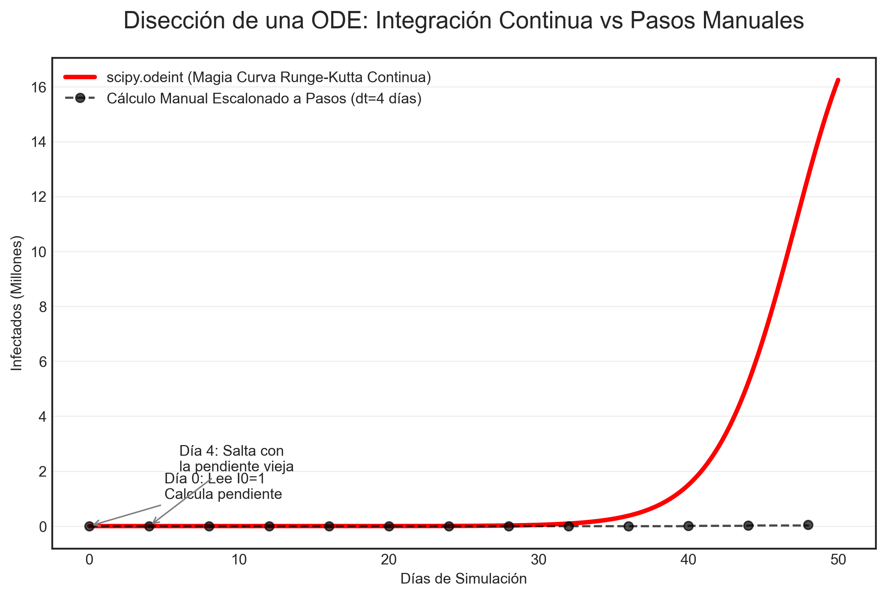

# Anatomía del Modelo SIR en Python (Scipy / ODEINT)

Este documento es una deconstrucción profunda del código fuente (`src/models/sir_dual.py`) diseñado para la exposición universitaria. Su objetivo es convertirte en un experto en la caja negra del modelado matemático.

---

## 1. El Significado de "y = S, I, R"

En matemáticas puras, $y$ usualmente representa el resultado final ($y = mx + b$). Sin embargo, en simulación de sistemas y ecuaciones diferenciales, la letra `y` minúscula representa un **Vector de Estado Central**.

En lugar de crear 3 variables separadas dando vueltas por el código, agrupamos la fotografía exacta del país al "Día Cero" en un solo paquete llamado "Estado".

```python
# Así se define en el código:
y0_TB = (S0_TB, I0_TB, R0_TB)
# Internamente esto es una tupla: (35092442, 7558, 0)
```

Cuando pasas la tupla `y` a la función matemática, la línea `S, I, R = y` hace un "desempaquetado" (*Unpacking*). Extrae las 3 variables individuales para poder multiplicarlas y realizar las ecuaciones.

---

## 2. La Función `deriv` (El Arquitecto del Sistema)

La función `deriv` NO integra ni hace proyecciones de futuro. Su único trabajo es responder a la pregunta: **"Tomando en cuenta las vacas que hay ahora mismo (tupla $y$), ¿A qué velocidad van a cambiar?".**

```python
def deriv(y, t, N, beta, gamma):
    S, I, R = y
    
    # Pendiente 1: ¿Cuántos sanos pierdo al día?
    dSdt = -beta * S * I / N
    
    # Pendiente 2: ¿Cuántos infectados nuevos gano, menos los que se mueren?
    dIdt = (beta * S * I / N) - (gamma * I)
    
    # Pendiente 3: ¿Cuántos cadáveres/recuperados acumulo?
    dRdt = gamma * I
    
    return dSdt, dIdt, dRdt
```
Si la curva de infectados fuera una montaña, `dIdt` es la brújula que le dice a la computadora si el paso siguiente es "hacia arriba" (pendiente positiva, la epidemia crece) o "hacia abajo" (pendiente negativa, epidemia muere).

---

## 3. ¿Por qué usamos `odeint` en vez de calcularlo a mano?

El usuario podría preguntarse: *"Si sé las ecuaciones, ¿por qué no hago un `for` loop del día 1 al 150 y lo calculo yo mismo multiplicando la pendiente por los días?"*.

¡Porque la pendiente cambia por debajo de tus narices cada minuto! 

### El ejemplo de calcular "A Mano" (Método Escalonado Libre - Euler)
Si tienes $I_0 = 1$, calculas que la pendiente hoy es +5 vacas enfermas. 
Si lo haces a mano, dices: *"Ah, en 10 días voy a tener 50 vacas enfermas (5x10)"*. Saltas del Día 0 al Día 10.
Pero **te equivocaste fatalmente**. Porque en el Día 2, la pendiente ya no era 5, era 20, y en el Día 5, la pendiente era 100. Al saltar ciegamente arrastrando la "pendiente vieja", terminaste calculando 50 vacas, cuando la realidad exponencial de la Fiebre Aftosa marca que deberías tener 5,000 vacas.

### La Magia de ODEINT
Eso es exactamente lo que hace `scipy.integrate.odeint`. En lugar de dar saltos ciegos de 1 día entero (que causan errores graves de arrastre visualizados como "escaleras"), utiliza algoritmos como **Runge-Kutta**.
1. Checa la pendiente en las 8:00 AM del Día 1.
2. Predice *ligeramente* dónde va a estar a mediodía sin avanzar todavía.
3. Checa la pendiente a mediodía para corregirse a sí misma.
4. Con ese promedio perfecto, recién dibuja el punto para el Día 2.



*(Observa en la gráfica cómo el cálculo a mano escalonado (negro) falla en entender la suavidad de la curva real integrada por SciPy (roja)).*

---

## 4. Retorno y Desempaquetado con Trasposición `.T`

Una vez que `odeint` recorrió los 150 puntos (`linspace`), escupe el resultado. Ese resultado es almacenado en las variables `ret_TB` o `ret_FMD`.

```python
ret_TB = odeint(deriv, y0_TB, t, args=(...))
```
**¿Qué es `ret_TB`?** Es una enorme matriz (Array/Tensor) bidimensional. Tiene 150 filas (una por cada día del `linspace`). Y en cada fila hay 3 columnas: [Susceptibles de ese día, Infectados de ese día, Recuperados de ese día].

Si quieres graficar a los infectados con Matplotlib (la "Y" cartesiana), no puedes dársela así (acostado). Necesitas aislar toda la lista de la columna del medio junta.
Ahí es donde entra **`.T` (Trasposición de matrices)**. 

El comando `ret_TB.T` "voltea" la matriz de manera que lo que eran filas ahora son 3 inmensas columnas verticales.
```python
S_TB, I_TB, R_TB = ret_TB.T
```
Al desempaquetarlo así, aislas la matemática y la conviertes en tres cables separados.
Ahí es donde `I_TB` adopta su forma final: Es un array unidimensional plano (ej. `[1, 5, 20, 100, ...]`) con exactamente 150 puntos. Listo para que la simple función cartesiana `ax.plot(t, I_TB)` grafique en tu pantalla.
