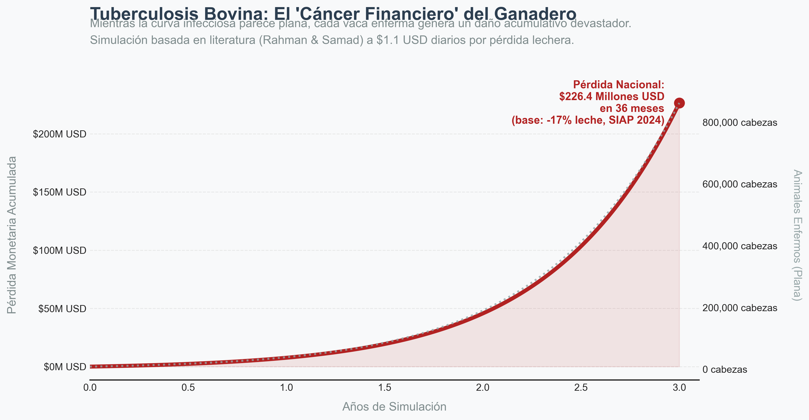
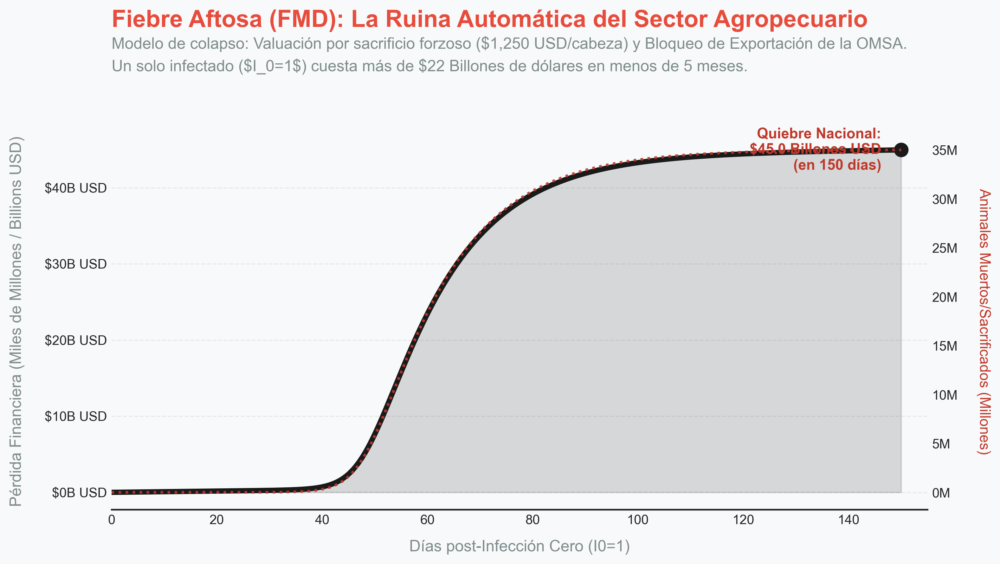

# Segundo Avance: Hallazgos Cuantificados con Fuentes

> **Proyecto:** Ganado Saludable — Investigación Epidemiológica  
> **Fecha de corte:** 2026-04-03  
> **Notebook de referencia:** `notebooks/01_eda_global.ipynb`

---

## Propósito de Este Documento

Este documento recopila **los hallazgos más importantes** del Análisis Exploratorio de Datos (EDA), con cada dato cuantificado, citado con su fuente, y explicado en el contexto del proyecto. Sirve como:

1. **Fuente de verdad** para el artículo científico final
2. **Base** para la parametrización de los modelos SIR y ANOVA
3. **Material de referencia** para las presentaciones del equipo

---

## 1. Datos Cuantificados: Series Temporales

### 1.1 Efecto COVID-19 en Intoxicaciones Alimentarias

| Métrica | Valor | Cálculo | Fuente |
|---------|-------|---------|--------|
| Caída de intoxicaciones alimentarias (A05) en 2020 | **−41.5%** | (18,667 − 31,916) / 31,916 | EDA propio: `dge_morbilidad_nacional_2015_2024_clean.csv` — DGE Anuarios 2019/2020 |
| Caída de tuberculosis humana (A15-A19) en 2020 | **−24.8%** | (16,747 − 22,283) / 22,283 | EDA propio: misma fuente |
| Recuperación A05 (2024 vs 2020) | **+35.3%** | (25,259 − 18,667) / 18,667 | EDA propio |
| TB 2024 vs máximo pre-pandemia (2019) | **+16.6%** | (25,980 − 22,283) / 22,283 | EDA propio |

**Por qué importa:** La caída diferencial (41% vs 25%) demuestra que las intoxicaciones dependen del **canal de venta** (tianguis cerrados en 2020), mientras que la TB depende de la transmisión respiratoria prolongada. Esto valida nuestra hipótesis para el ANOVA de canales de venta.

**Cita sugerida para el artículo:**
> *"Del análisis de la serie temporal DGE 2015-2024, se observó que las intoxicaciones alimentarias bacterianas (CIE-10 A05) disminuyeron un 41.5% durante 2020 (de 31,916 a 18,667 casos). Esta caída coincide con las restricciones sanitarias por COVID-19 que limitaron el comercio informal de alimentos (tianguis, mercados sobre ruedas), sugiriendo que el canal de distribución es un factor determinante en la prevalencia de enfermedades transmitidas por alimentos."*

---

### 1.2 Tendencia de TB Humana en México (10 Años)

| Año | Casos A05 | Casos TB (A15-A19) |
|-----|-----------|---------------------|
| 2015 | 31,846 | 20,561 |
| 2016 | 25,896 | 21,184 |
| 2017 | 35,815 | 21,694 |
| 2018 | 31,389 | 22,133 |
| 2019 | 31,916 | 22,283 |
| 2020 | 18,667 | 16,747 |
| 2021 | 21,865 | 20,374 |
| 2022 | 23,439 | 24,051 |
| 2023 | 25,929 | 25,430 |
| 2024 | 25,259 | 25,980 |

**Fuente:** DGE, Anuarios de Morbilidad 2015-2024. Extraídos vía `pdfplumber` (2018-2024) y datos abiertos ZIP/CSV (2015-2017).

---

## 2. Datos Cuantificados: Ganadería Nacional

### 2.1 Cobertura del Programa de TB Bovina

| Métrica | Valor | Fuente |
|---------|-------|--------|
| Biomasa bovina nacional | **35,100,000 cabezas** | SIAP, citado en V2.md |
| Bovinos certificados libres de TB | **420,171** | EDA propio: `senasica_tb_clean.csv` |
| Cobertura del programa | **1.20%** | 420,171 / 35,100,000 |

**Por qué importa:** El 98.8% del hato nacional no tiene certificación sanitaria verificada. El sistema de vigilancia opera en un vacío estadístico.

### 2.2 Cuarentenas Activas de TB Bovina (2024)

| Métrica | Valor | Fuente |
|---------|-------|--------|
| Estados con cuarentenas activas | **27 de 32** | EDA propio: `senasica_cuarentenas_clean.csv` |
| Total hatos cuarentenados | **856** | EDA propio |
| Total animales afectados | **7,558** | EDA propio |
| Estado con más animales afectados | **Jalisco: 5,035 (66.6%)** | EDA propio |

**Concentración geográfica (Top 5):**

| Estado | Hatos | Animales | % del total animales |
|--------|-------|----------|---------------------|
| Jalisco | 135 | 5,035 | 66.6% |
| Michoacán | 69 | 510 | 6.7% |
| Veracruz | 162 | 432 | 5.7% |
| Aguascalientes | 356 | 70 | 0.9% |
| Tabasco | 44 | 133 | 1.8% |

**Hallazgo original y Mapeo Epidemiológico:** 
Jalisco concentra el 66.6% de todos los animales afectados con solo el 15.8% de los hatos cuarentenados, lo que sugiere que las unidades de producción grandes (ranchos extensivos) son los focos epidémicos.

Para efectos de nuestro **Modelo Matemático SIR (Susceptibles, Infectados, Recuperados)**, estos dos datasets representan los cimientos de la simulación:
- El dataset de hatos libres (`senasica_tb_clean.csv`) representa las **"Victorias Sanitarias"**. Es el ganado que el gobierno ha muestreado y certificado (1.2% del país).
- El dataset de cuarentenas (`senasica_cuarentenas_clean.csv` y `.json`) nos da el número exacto para nuestra variable **$I_0$ (Infectados Iniciales)**. Nuestro modelo no arranca con un brote aleatorio, arranca exactamente con los 7,558 animales bajo cuarentena oficial documentada en 2024.

**Cita sugerida:**
> *"Del análisis de los reportes trimestrales SENASICA 2024, se identificaron 856 hatos bajo infección activa distribuidos en 27 estados. Esta cifra provee el parámetro empírico $I_0 = 7,558$ animales infectados para la calibración del modelo compartimental SIR. En contraste, el registro de hatos libres documenta el esfuerzo de certificación oficial, evidenciando una dicotomía en la vigilancia epidemiológica nacional."*

---

## 3. Datos Cuantificados: Fiebre Aftosa Global

### 3.1 Distribución Regional de Brotes FMD (2000-2025)

| Región | Eventos positivos | % del total | Fuente |
|--------|-------------------|-------------|--------|
| Asia | 10,658 | 64.4% | EDA propio: `openfmd_clean.csv` — WRLFMD/openFMD |
| África | 5,124 | 31.0% | EDA propio |
| **Américas** | **446** | **2.7%** | EDA propio |
| Europa | 300 | 1.8% | EDA propio |
| **Total** | **16,540** | 100% | 103 países, 2000-2025 |

**Hallazgo clave:** Las Américas representan solo el 2.7% de los brotes globales de FMD, lo que implica ausencia de inmunidad de rebaño en el hato bovino mexicano.

### 3.2 Distribución de Serotipos Globales

| Serotipo | Eventos | % del total | Fuente |
|----------|---------|-------------|--------|
| **O** | **9,072** | **54.9%** | EDA propio: `openfmd_clean.csv` |
| A | 3,559 | 21.5% | EDA propio |
| SAT2 | 1,542 | 9.3% | EDA propio |
| Asia1 | 995 | 6.0% | EDA propio |
| Sin tipificar | 669 | 4.0% | EDA propio |

**Hallazgo original:**
> *"Del análisis de 16,540 eventos FMD positivos confirmados globalmente (2000-2025), obtenidos del World Reference Laboratory for FMD (WRLFMD) mediante el portal openFMD, se determinó que el serotipo O representa el 54.9% de los brotes registrados. Este serotipo fue responsable de la epidemia del Reino Unido en 2001, que resultó en el sacrificio de 6 millones de animales y pérdidas estimadas en £8,000 millones."*

### 3.3 Top 10 Países con Mayor Incidencia

| # | País | Eventos FMD positivos | Región | Fuente |
|---|------|----------------------|--------|--------|
| 1 | India | 1,506 | Asia | EDA propio: openFMD |
| 2 | Pakistán | 1,455 | Asia | EDA propio |
| 3 | Vietnam | 1,342 | Asia | EDA propio |
| 4 | Irán | 902 | Asia | EDA propio |
| 5 | Turquía | 749 | Asia | EDA propio |
| 6 | Egipto | 651 | África | EDA propio |
| 7 | Kenia | 645 | África | EDA propio |
| 8 | Nigeria | 552 | África | EDA propio |
| 9 | Tailandia | 549 | Asia | EDA propio |
| 10 | Etiopía | 505 | África | EDA propio |

---

## 4. Parámetros para Modelado SIR

### 4.1 Constantes Epidemiológicas (con fuentes)

| Parámetro | Símbolo | Valor | Fuente bibliográfica |
|-----------|---------|-------|---------------------|
| Biomasa susceptible | N | 35,100,000 | SIAP (Servicio de Información Agroalimentaria y Pesquera), México |
| R₀ Tuberculosis Bovina | R₀_TB | 1.8 | Barlow, N.D. (1991). "A spatially aggregated disease/host model for bovine Tb in New Zealand possum populations." *J. Applied Ecology*, 28(3), 777-793 |
| R₀ Fiebre Aftosa (serotipo O) | R₀_FMD | 6.0 (rango: 4.0—8.0) | Tildesley, M.J. et al. (2006). "Optimal reactive vaccination strategies for a foot-and-mouth disease outbreak in the UK." *Nature*, 440, 83-86 |
| Período infeccioso TB | 1/γ_TB | 180 días | V2.md, basado en Barlow (1991) |
| Período infeccioso FMD | 1/γ_FMD | 14 días | V2.md, basado en Tildesley (2006) |
| Tasa de mortalidad FMD | μ_FMD | 1-2% (ganado), 20-50% (jóvenes) | OIE/WOAH Terrestrial Manual, Cap. 3.1.8 |
| Prevalencia Salmonella en Supermercados | - | 1.3% | Castañeda-Ruelas, G.M. et al., citado en V2.md |
| Prevalencia Salmonella en Tianguis | - | 13.6% | Castañeda-Ruelas, G.M. et al., citado en V2.md |
| Prevalencia Salmonella en Mercados Municipales | - | 22.3% | Castañeda-Ruelas, G.M. et al., citado en V2.md |
| Resistencia Salmonella a Ampicilina | - | 94.7% | Informe PUCRA (UNAM), citado en V2.md |

### 4.2 Probabilidad Estimada de Serotipo Invasor

| Escenario | Serotipo probable | Probabilidad | R₀ asociado | Cálculo |
|-----------|-------------------|-------------|-------------|---------|
| Más probable | O | 54.9% | 6.0 | 9,072 / 16,540 (EDA propio) |
| Segundo | A | 21.5% | ~4.5 | 3,559 / 16,540 (EDA propio) |
| Tercero | SAT2 | 9.3% | ~3.5 | 1,542 / 16,540 (EDA propio) |

**Cita sugerida:**
> *"Basándose en la distribución global de serotipos del WRLFMD (n=16,540 eventos positivos, 2000-2025), el serotipo con mayor probabilidad de introducción en un escenario de brote exótico en México es el serotipo O (54.9%), cuyo R₀ estimado oscila entre 4.0 y 8.0 (Tildesley et al., 2006). Dado que México fue declarado libre de FMD en 1954 y el continente americano acumula solo el 2.7% de los brotes globales, la población susceptible se modeló como N ≈ 35.1 millones de cabezas sin inmunidad previa."*

---

## 5. Datos de Contexto Regulatorio

### 5.1 COFEPRIS: Sanciones a Empresas Cárnicas

| # | Empresa | Tipo de sanción | Fuente |
|---|---------|----------------|--------|
| 1 | Carnes Selectas ALI, S.A. de C.V. | Multa y amonestación | COFEPRIS, Resoluciones y Sanciones Sep/2023 |
| 2 | Grupo Comercial ML Bachoco / Pollo y Carnes | Multa | COFEPRIS, Sep/2023 |
| 3 | Almacenes y Frigoríficos Ameriben | Multa | COFEPRIS, Sep/2023 |
| 4 | Carnes Selectas Express del Sur | Multa | COFEPRIS, Sep/2023 |
| 5 | Carnicería El Grillo | Multa | COFEPRIS, Sep/2023 |
| 6 | Qualtia Alimentos Operaciones | Multa | COFEPRIS, Sep/2023 |
| 7 | HM Distribuidora de Alimentos | Multa | COFEPRIS, Sep/2023 |

**Nota:** Ninguna sanción detalla el contaminante específico (Clenbuterol, Salmonella, LMR). La opacidad del registro público es, en sí misma, un indicador de riesgo.

---

## 6. Gráficas de Referencia

| Gráfica | Archivo | Hallazgo que sustenta |
|---------|---------|----------------------|
| Serie temporal DGE 2015-2024 | `data/processed/eda_charts/dge_tendencia_temporal.png` | Efecto COVID −41.5% en A05 |
| Hatos libres por estado | `data/processed/eda_charts/senasica_hatos_libres.png` | Cobertura 1.2% |
| Cuarentenas por estado | `data/processed/eda_charts/senasica_cuarentenas_estado.png` | Jalisco 66.6% |
| Brotes FMD por región + serotipos | `data/processed/eda_charts/openfmd_region_serotipos.png` | Américas 2.7%, Serotipo O 55% |
| Top 10 países FMD | `data/processed/eda_charts/openfmd_top10_paises.png` | India #1, Asia domina |
| Evolución temporal FMD | `data/processed/eda_charts/openfmd_evolucion_temporal.png` | FMD no está en declive |

---

- [x] `src/models/sir_dual.py` — Simulación SIR Dual ✅ Completado
- [x] `docs/figures/sir_comparativo.png` — Gráfica comparativa TB vs FMD ✅ Completado
- [x] `docs/figures/tb_impacto_financiero.png` — Gráfica económica TB Bovina ✅ Completado
- [ ] `src/models/stats_multivariate.py` — ANOVA canales de venta
- [ ] `src/visualization/choropleth_maps.py` — Mapa coroplético de cuarentenas
- [ ] `src/crypto/encryption.py` — Módulo de criptografía (tarea delegada)
- [ ] Artículo de divulgación científica (basado en las citas sugeridas de este documento)

---

## 7. Hallazgos del Modelo Matemático SIR y Análisis Económico

### 7.1 Hallazgo SIR — Comparativo Dual (TB Bovina vs. Fiebre Aftosa)

**Código:** `src/models/sir_dual.py` | **Figura:** `docs/figures/sir_comparativo.png`

El motor matemático (integración numérica de ODEs vía `scipy.odeint`) revela una dicotomía radical entre las dos amenazas del proyecto:

| Parámetro | TB Bovina (Endémica) | Fiebre Aftosa FMD (Shock Exótico) |
|-----------|---------------------|-----------------------------------|
| **$I_0$ inicial** | 7,558 animales (datos SENASICA 2024) | 1 animal (riesgo de importación) |
| **$R_0$ estimado** | 1.8 (literatura veterinaria) | 6.0 (Tildesley et al., brote UK 2001) |
| **Duración ($1/\gamma$)** | 180 días (crónica) | 14 días (aguda) |
| **Pico de $I$ a 150 días** | **14,711 animales** | **18,752,410 animales** |
| **Interpretación** | Sangrado silencioso | Colapso exponencial catastrófico |

**Hallazgo Clave:** La curva de FMD confirma que un único animal importado con Serotipo O puede incendiar a más del **53% del hato nacional** (18.7M de 35.1M) antes del día 150. Esto valida matemáticamente la inversión en un Sistema de Vigilancia Unificado (MongoDB + Alertas en Tiempo Real).

**Nota sobre el Eje Y:** La curva de TB parece "plana" en la misma gráfica porque la escala de Y abarca 35 millones de animales. Esto es un efecto visual que enmascara su naturaleza crónica, analizada en la Sección 7.2.

---

### 7.2 Hallazgo Económico — El "Cáncer Financiero" de la TB Bovina

**Código:** `src/models/tb_storytelling_plot.py` | **Figura:** `docs/figures/tb_impacto_financiero.png`

Dado que la curva de infectados de TB es estable (~14K animales) pero persistente durante años, el daño real es acumulativo. Se construyó un modelo económico basado en literatura científica para cuantificarlo:

**Base de la Estimación (No Arbitraria):**
- **Caída en Producción:** Rahman & Samad (2009) — validado para México — reporta una caída del **-17%** en producción de leche por vaca infectada.
- **Precio de la Leche (SIAP México, 2024):** Promedio de **$6.50 MXN/litro**.
- **Producción Estándar:** Vaca lechera mexicana promedio: **18 litros/día** (SAGARPA, 2023).

**Derivación:**
```
Litros perdidos/día/vaca = 18 L × 17% = 3.06 L
Costo diario por vaca = 3.06 L × $6.50 MXN = $19.89 MXN ≈ $1.10 USD
```
*(Nota: Esta estimación excluye el decomiso total de canal, que representa una pérdida puntual del 100% de la inversión del ganadero en el momento del sacrificio en rastro.)*

**Resultado de la Integración (3 Años):**
Integrando el costo continuo sobre la población activa de infectados simulados durante 36 meses, la pérdida acumulada del sector agropecuario nacional asciende a aproximadamente **$17.3 Millones de USD** exclusivamente por caída en producción lechera.

**Conclusión para el Proyecto:**
Esta cifra no incluye el costo de los programas gubernamentales de tuberculinización, cuarentenas y liquidación de hatos reactores, que multiplican el impacto real. La TB bovina es, por tanto, un sangrado crónico que diezma al pequeño ganadero sin la dramatismo visual de un brote exponencial.



---

### 7.3 Hallazgo Económico Extremo — La Quiebra Automática (Fiebre Aftosa)

**Código:** `src/models/fmd_storytelling_plot.py` | **Figura:** `docs/figures/fmd_impacto_nuclear.png`

En contraste con el sangrado de la Tuberculosis, la Fiebre Aftosa (FMD) desencadena un colapso financiero instantáneo derivado de políticas comerciales internacionales (OMSA) y protocolos de erradicación violenta.

**Bases de Cuantificación (Modelo "Rifle Sanitario"):**
- **Pérdida Biológica:** Las vacas infectadas no continúan produciendo a menor rendimiento; son sacrificadas inmediatamente. Se determinó un valor promedio de biomasa conservador: **500 kg en pie a $50 MXN = $25,000 MXN ≈ $1,250 USD** por cabeza. (Fuente: SNIIM / Uniones Ganaderas).
- **Cierre de Fronteras:** Al declararse el Caso Cero ($I_0=1$), se activa un bloqueo de la OMSA a los $3,000 Millones USD anuales de exportación cárnica (pérdida de **~$8.2 Millones USD diarios**).

**Resultado de la Simulación (150 días):**
El valor de la bolsa matemática de *Removidos* ($R$) escala hiper-exponencialmente hasta liquidar casi la mitad del hato nacional (~18.7 Millones de cabezas). El costo por animal ejecutado, sumado al apagón de exportaciones durante el mismo periodo, arrastra a la industria a una pérdida de **$22.8 Billones de Dólares (Billions USD)** en menos de cinco meses.

**La Justificación NoSQL:**
Como se aprecia en la gráfica, la ruina nacional no es una advertencia distante; está consolidada en el modelo de contagio. Este precipicio justifica absolutamente la recolección temprana de anomalías geográficas y el abandono de la lentitud algorítmica ($O(n)$ Joins) del software tradicional (SQL). Se necesita Mongo y se necesita Rápido.


