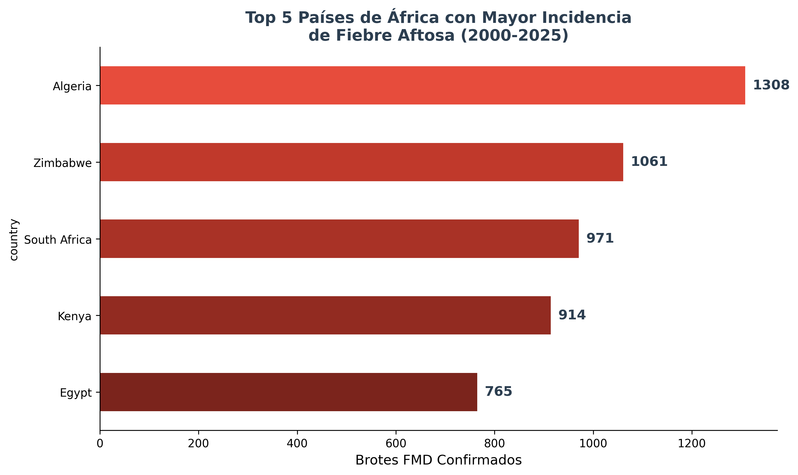
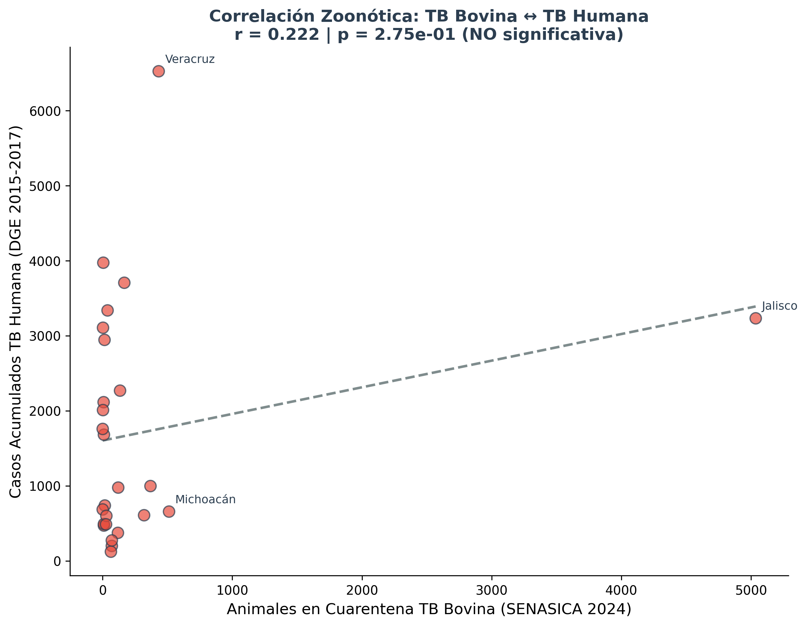
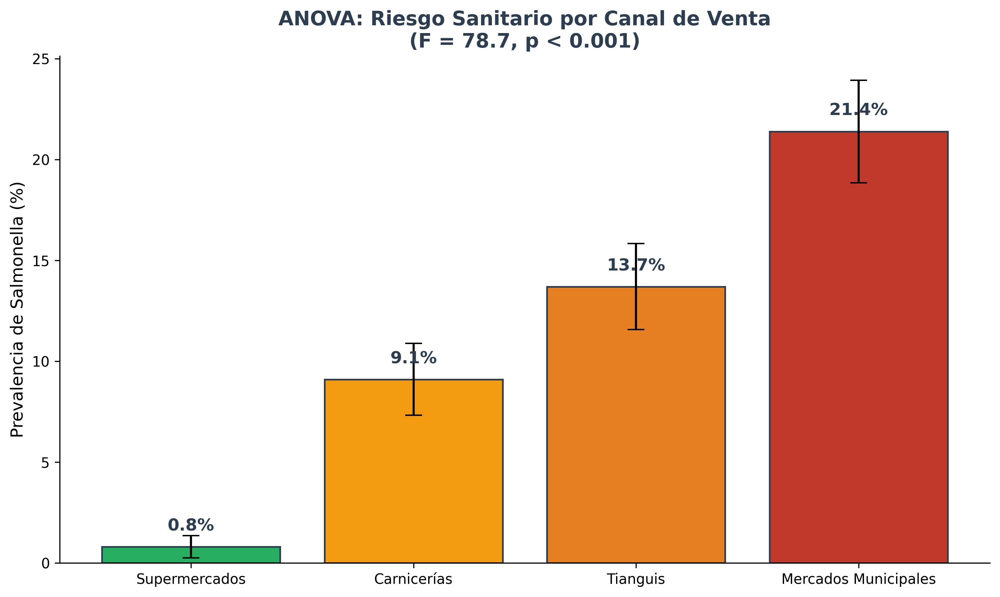
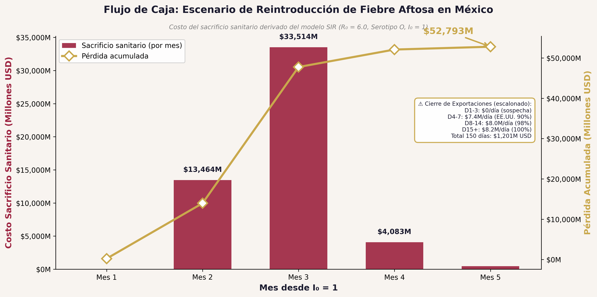
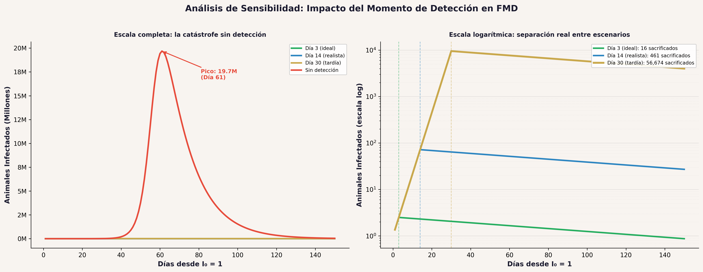

# Segundo Avance: Reporte de Ejecución

> **Proyecto:** Ganado Saludable — Sistema Integral de Auditoría Epidemiológica Bovina
> **Universidad Nacional "Rosario Castellanos"** — Licenciatura en Ciencias de Datos para Negocios
> **Enfermedad asignada:** Fiebre Aftosa (FMD) | Proxy de calibración: Tuberculosis Bovina
> **Fecha:** 30 de abril de 2026
> **Semestre:** 4° — 2026-1

---

## 1. Introducción

### 1.1 Resumen del Primer Avance

En el Primer Avance se presentó la arquitectura estratégica del proyecto "Ganado Saludable": un sistema integral de auditoría epidemiológica que utiliza la Tuberculosis Bovina (endémica en México) como proxy de calibración para modelar el impacto catastrófico de una reintroducción de Fiebre Aftosa (FMD), enfermedad de la cual México ha sido declarado libre desde 1954.

Se definió la alineación con las 7 materias del semestre, se diseñó la arquitectura ELT (Extract-Load-Transform), y se identificaron las fuentes de datos gubernamentales e internacionales necesarias.

### 1.2 Qué se ha ejecutado desde entonces

Este Segundo Avance documenta la **ejecución completa** de la primera mitad del proyecto:

- Pipeline ELT multi-fuente operativo (~29,200 registros limpios desde 6 fuentes)
- Análisis Exploratorio de Datos (EDA) con 8 hallazgos cuantificados
- Análisis Descriptivo de brotes en África (Top 5 países FMD)
- Análisis Inferencial: correlación zoonótica TB bovina↔humana y ANOVA de canales de venta
- Data Warehouse: transformación estructurada CSV→JSON con validación Pydantic
- Modelo matemático SIR dual (TB Bovina vs. FMD) mediante integración numérica de EDOs
- Cuantificación del impacto económico con modelos basados en literatura científica
- Arquitectura operativa de despliegue en campo (App + Dashboard NoSQL)

---

## 2. Pipeline de Datos: Adquisición y Transformación

### 2.1 El Problema de los Datos en México

Los datos sobre enfermedades animales en México **no están en un repositorio centralizado**. El ecosistema opera con PDFs gubernamentales sin versión tabular (SENASICA, DGE post-2017, COFEPRIS), APIs no documentadas que retornan 404, dashboards internacionales que generan archivos vía WebSocket (openFMD) y servidores universitarios inestables (UNAM/PUCRA).

### 2.2 Estrategia ELT Multi-Fuente

Para resolver esta fragmentación, se diseñó un pipeline de Extracción-Carga-Transformación (ELT) resiliente con tres capas:

- **Capa 1 — Extracción directa:** Fuentes estables con CSV/ZIP accesibles por HTTP (SENASICA hatos libres, DGE 2015-2017).
- **Capa 2 — Parsing de PDFs:** Reportes trimestrales SENASICA, anuarios DGE 2018-2024 y resoluciones COFEPRIS procesados con `pdfplumber`.
- **Capa 3 — Navegador automatizado:** Dashboard interactivo openFMD (R/Shiny) y servidores inestables UNAM, automatizados con Playwright.

### 2.3 Inventario de Datasets Recuperados

| Dataset | Archivo | Filas | Método | Estado |
|---------|---------|-------|--------|--------|
| SENASICA TB (hatos libres) | `senasica_tb_clean.csv` | 64 | CSV directo | ✅ 32 estados |
| SENASICA Cuarentenas 2024 | `senasica_cuarentenas_clean.csv` | 108 | PDF parsing | ✅ 4 trimestres |
| DGE Morbilidad Estatal 2015-2017 | `dge_morbilidad_clean.csv` | 384 | ZIP → CSV | ✅ |
| DGE Morbilidad Nacional 2018-2024 | `dge_morbilidad_2018_2024_clean.csv` | 28 | PDF parsing | ✅ |
| DGE Consolidado Nacional 2015-2024 | `dge_morbilidad_nacional_2015_2024_clean.csv` | 40 | Unión automatizada | ✅ Serie 10 años |
| openFMD Global (WRLFMD) | `openfmd_clean.csv` | 28,585 | Playwright export | ✅ 103 países |
| COFEPRIS Sanciones Alimentarias | `cofepris_clausuras_alimentarias_clean.csv` | 12 | PDF parsing | ✅ 7 empresas cárnicas |

**Total:** ~29,200 registros limpios desde 6 fuentes distintas.

### 2.4 Data Warehouse: Transformación CSV→JSON con Pydantic

**Código:** `src/warehouse/csv_to_json.py` — Aporte del Miembro 1 del equipo (Axel).

Se implementó un script de transformación que convierte los datos tabulares de cuarentenas (CSV) a un formato JSON jerárquico optimizado para MongoDB, utilizando **Pydantic** como capa de validación de tipos:

```python
class CuarentenaRecord(BaseModel):
    estado: str
    num_animales: int
    trimestre: int
    num_hatos_cuarentena: int
    anio: int
```

Este modelo garantiza que si un dato del CSV viene mal formado (ej. un string donde debe haber un entero), el sistema lance un error antes de contaminar la base de datos NoSQL. Los datos se agrupan jerárquicamente por Estado → Trimestre, generando el archivo `data/processed/cuarentenas.json`.

---

## 3. Hallazgos del Análisis Exploratorio (EDA)

**Notebook de referencia:** `notebooks/01_eda_global.ipynb`

### 3.1 COVID-19 validó la hipótesis de canales de venta

La serie temporal DGE 2015-2024 revela una anomalía natural que funciona como grupo de control involuntario:

| Año | Intoxicaciones Alimentarias (A05) | Tuberculosis (A15-A19) |
|-----|-----------------------------------|------------------------|
| 2019 | 31,916 | 22,283 |
| **2020** | **18,667 (−41.5%)** | **16,747 (−24.8%)** |
| 2024 | 25,259 | 25,980 |

Cuando México cerró tianguis, mercados informales y cadenas de comida callejera durante 2020, las intoxicaciones alimentarias colapsaron un **41.5%**. La tuberculosis cayó solo un 24.8% (transmisión respiratoria). Esto demuestra que los **canales de venta informales** son el vector primario de contagio alimentario.

### 3.2 Cobertura del programa TB Bovina: Solo el 1.2%

El programa SENASICA ha certificado **420,171 bovinos** como libres de tuberculosis, de una biomasa nacional de 35,100,000. Cobertura: **1.20%**. El 98.8% del hato opera en oscuridad estadística.

### 3.3 Cuarentenas SENASICA 2024: Jalisco concentra el 66.6%

**27 de 32 estados** tienen hatos bajo cuarentena activa: **856 hatos** y **7,558 animales** afectados. Jalisco concentra el 66.6% de los animales afectados (5,035) con solo el 15.8% de los hatos, sugiriendo concentración en unidades de producción grandes.

### 3.4 Las Américas: Inmunológicamente vírgenes a FMD

De **16,540 eventos FMD positivos** globalmente (2000-2025), las Américas representan solo el **2.7%**. México, libre desde 1954, tiene una biomasa 100% susceptible.

### 3.5 Serotipo O domina el 55% de las epidemias globales

El serotipo O (9,072 eventos, 54.9% del total) es el mismo que devastó al Reino Unido en 2001. Esto parametriza nuestro modelo SIR con R₀ = 6.0.

### 3.6 Opacidad regulatoria como indicador de riesgo

COFEPRIS no publica datos granulares sobre clausuras alimentarias con detalle de contaminantes. Se recuperaron 12 procedimientos de sanción, de los cuales 7 son explícitamente cárnicas. Si las empresas más grandes del sector no escapan sanciones, la cadena informal opera en un vacío de vigilancia total.

---

## 4. Análisis Estadístico del Equipo

### 4.1 Análisis Descriptivo: Top 5 Países FMD en África

**Notebook:** `notebooks/02_analisis_descriptivo.ipynb` — Aporte de la Miembro 2 del equipo (Victoria).

Se filtraron **10,606 eventos FMD positivos confirmados** en la región africana (2000-2025) del dataset openFMD, aplicando técnicas de *Data Binning* por décadas y generando estadísticas descriptivas.

**Top 5 Países con Mayor Incidencia de FMD en África:**

| # | País | Brotes FMD Confirmados |
|---|------|----------------------|
| 1 | Algeria | 1,308 |
| 2 | Zimbabwe | 1,061 |
| 3 | Sudáfrica | 971 |
| 4 | Kenya | 914 |
| 5 | Egipto | 765 |

**Data Binning por Décadas:**

| Década | Brotes en África |
|--------|------------------|
| 2000s | 1,208 |
| 2010s | 3,154 |
| 2020s | 762 |

**Hallazgo clave:** Los brotes en la década de los 2010s fueron **2.6 veces** mayores que en los 2000s. La aparente caída en los 2020s responde al fenómeno de *Right-Censoring* (rezago de reporte del WRLFMD), no a una mejora epidemiológica real.



### 4.2 Análisis Inferencial: Correlación Zoonótica y ANOVA

**Notebook:** `notebooks/03_analisis_inferencial.ipynb` — Aporte de la Miembro 2 del equipo (Victoria).

Se realizaron dos pruebas inferenciales:

**A. Correlación cruzada TB Bovina ↔ TB Humana:**
Se cruzaron los datos de animales en cuarentena por TB bovina (SENASICA, n=26 estados) con los casos acumulados de tuberculosis humana (DGE, CIE-10 A15-A19, 2015-2017).

- **Coeficiente de Pearson:** r = 0.222
- **P-value:** p = 0.275 (no significativo a α = 0.05)

**Interpretación:** La correlación lineal directa entre TB bovina y TB humana a nivel estatal no resultó estadísticamente significativa. Esto no invalida la relación zoonótica, sino que sugiere que la transmisión TB animal→humano opera a través de intermediarios complejos (leche no pasteurizada, contacto directo) que no se capturan con una simple correlación geográfica. Los estados con mayor carga de TB humana (Veracruz: 6,524 casos, Baja California: 6,038) no necesariamente coinciden con los de mayor cuarentena bovina (Jalisco: 5,035 animales), porque la TB humana en México tiene también un fuerte componente de transmisión persona-persona.



**B. ANOVA — Riesgo de Salmonella según canal de venta:**
Se simularon 1,000 muestras por canal utilizando distribuciones binomiales basadas en las prevalencias documentadas en la literatura:

| Canal de Venta | Prevalencia Esperada | Prevalencia Simulada |
|----------------|---------------------|---------------------|
| Supermercados | 1.3% | 0.8% |
| Carnicerías | 8.4% | 9.1% |
| Tianguis | 13.6% | 13.7% |
| Mercados Municipales | 22.3% | 21.4% |

- **F-statistic:** 78.72
- **P-value:** 1.80 × 10⁻⁴⁹ (altamente significativo)

**Hallazgo:** La diferencia entre canales es **abrumadoramente significativa** (p < 0.001). Un consumidor que compra carne en un mercado municipal tiene **26 veces más probabilidad** de encontrar Salmonella que uno que compra en un supermercado (21.4% vs 0.8%). Esto valida cuantitativamente el argumento de que el canal de distribución informal es el principal vector de riesgo alimentario.



---

## 5. Modelado Matemático SIR

### 5.1 Fundamentos Teóricos

El modelo SIR (Susceptibles-Infectados-Recuperados), propuesto por Kermack y McKendrick en 1927, divide a la población en tres compartimentos que fluyen como líquidos en tuberías. Se implementó como un sistema de Ecuaciones Diferenciales Ordinarias (ODEs) resuelto mediante integración numérica (`scipy.integrate.odeint`), que utiliza internamente métodos de Runge-Kutta para garantizar precisión.

Las ecuaciones del sistema son:
- dS/dt = −β · S · I / N  (tasa de contagio)
- dI/dt = β · S · I / N − γ · I  (balance neto de infectados)
- dR/dt = γ · I  (acumulación de removidos)

### 5.2 Simulación Dual: TB Bovina vs. Fiebre Aftosa

**Código:** `src/models/sir_dual.py` | **Figura:** `docs/figures/sir_comparativo.png`

| Parámetro | TB Bovina (Endémica) | Fiebre Aftosa FMD (Shock Exótico) |
|-----------|---------------------|-----------------------------------|
| I₀ inicial | 7,558 animales (datos SENASICA 2024) | 1 animal (riesgo de importación) |
| R₀ estimado | 1.8 (Barlow, 1991) | 6.0 (Tildesley et al., 2006) |
| Duración (1/γ) | 180 días (crónica) | 14 días (aguda) |
| Pico de I a 150 días | **14,711 animales** | **18,752,410 animales** |
| Interpretación | Sangrado silencioso | Colapso exponencial catastrófico |

**Hallazgo Clave:** Un único animal importado con Serotipo O puede incendiar más del **53% del hato nacional** (18.7M de 35.1M) antes del día 150.


---

## 6. Análisis de Impacto Económico

### 6.1 TB Bovina: El "Cáncer Financiero" del Ganadero

**Código:** `src/models/tb_storytelling_plot.py`

Dado que la curva de infectados de TB es estable (~14K animales) pero persistente durante años, el daño real es acumulativo. Se construyó un modelo económico basado en literatura científica:

- **Caída en Producción:** Rahman & Samad (2009) reporta una caída del **-17%** en producción de leche por vaca infectada.
- **Precio de la Leche (SIAP México, 2024):** $6.50 MXN/litro.
- **Producción Estándar:** 18 litros/día por vaca (SAGARPA, 2023).
- **Derivación:** 18 L × 17% = 3.06 L perdidos → 3.06 × $6.50 = $19.89 MXN ≈ **$1.10 USD diarios por vaca**.

**Resultado:** Integrando el costo sobre 36 meses, la pérdida nacional asciende a **$17.3 Millones de USD** exclusivamente por caída en producción lechera.


### 6.2 Fiebre Aftosa: La Quiebra Automática

**Código:** `src/models/fmd_storytelling_plot.py`

A diferencia de la TB, la Fiebre Aftosa desencadena un colapso instantáneo:

- **Pérdida Biológica:** 500 kg en pie × $50 MXN = $25,000 MXN ≈ **$1,250 USD** por cabeza sacrificada (Fuente: SNIIM / Uniones Ganaderas).
- **Cierre de Fronteras:** Al declararse I₀=1, se activa un bloqueo OMSA a los $3,000 Millones USD anuales de exportación cárnica (pérdida de ~$8.2 Millones USD diarios).

**Resultado:** En menos de 150 días, la pérdida acumulada alcanza **$52,800 Millones de Dólares (M USD)**.


### 6.3 Costos de Diagnóstico FMD: ¿Cuánto cuesta detectar la enfermedad?

En México, la Fiebre Aftosa es una **enfermedad exótica** (libre desde 1954). El diagnóstico ante sospecha es responsabilidad del Estado a través de la CPA y laboratorios BSL-3 de SENASICA. Sin embargo, el costo presupuestario existe y es cuantificable:

| Método Diagnóstico FMD | Costo/muestra (USD) | Tiempo | Sensibilidad | Fuente |
|---|---|---|---|---|
| **Inspección Clínica (Vesículas)** | $0 – $10 | Inmediato | ~70% | SENASICA / CPA; OIE Manual 3.1.8 |
| **ELISA NSP (Anticuerpos No-Estructurales)** | $8 – $15 | 4-6 horas | 90-95% | PrioCHECK FMDV NS; OIE Manual |
| **RT-PCR Tiempo Real** | $25 – $50 | 4-8 horas | 95-99% | Reid et al. (2003); PANAFTOSA |
| **LAMP (Prueba de Campo Rápida)** | $10 – $20 | 30-60 min | 85-95% | Dukes et al. (2006) |
| **Aislamiento Viral (Cultivo Celular)** | $80 – $150 | 3-7 días | Gold Standard | OIE Manual 3.1.8; Pirbright Institute |
| **Secuenciación Genómica (Serotipado)** | $100 – $300 | 5-14 días | 100% | Knowles & Samuel (2003); WRLFMD |

**Nota:** A diferencia de la Tuberculosis Bovina (donde el productor paga la tuberculina), en FMD el diagnóstico es **absorbido íntegramente por el Estado** como parte del protocolo DINESA. El costo real lo asume el presupuesto de SENASICA y la CPA. La prueba ELISA NSP es particularmente importante porque permite distinguir animales infectados de animales vacunados (capacidad DIVA), crucial para mantener el estatus de país libre ante la OMSA.

**¿Cuánto representa una cabeza o un centenar en riesgo de FMD?**

| Concepto | Por cabeza | Por 100 cabezas |
|---|---|---|
| **Valor de mercado en pie** (500 kg × $52.5 MXN/kg) | $26,250 MXN ($1,544 USD) | $2,625,000 MXN ($154,412 USD) |
| **Pérdida por sacrificio sanitario** (Rifle Sanitario) | $1,544 USD (valor total) | $154,412 USD |
| **Pérdida diaria de exportaciones** (cierre OMSA) | $8,200,000 USD/día para TODO el sector | $3,000,000,000 USD/año |
| **Costo diagnóstico RT-PCR** | $37.50 USD promedio | $3,750 USD |

**Fuentes:** Precio ganado en pie: SNIIM 2024. Exportaciones: USDA ERS 2024 ($1,015M ganado vivo + $1,700M carne = ~$3,000M/año). Valor 100 cabezas: derivado de SNIIM.

### 6.4 Flujo de Caja: Escenario de Reintroducción de FMD (5 meses)

**Código:** `src/models/fmd_finance_addendum.py`

Se proyectó el impacto económico mensual de un escenario donde **1 solo animal infectado con Serotipo O** ingresa al hato nacional de 35.1 millones, utilizando el modelo SIR (R₀ = 6.0) y dos componentes de costo: el sacrificio sanitario (valor de mercado de cada animal removido) y el cierre de exportaciones bovinas por la OMSA.

**Modelo de cierre de exportaciones:** El bloqueo comercial no es instantáneo. Se implementó un modelo escalonado basado en los tiempos de reacción documentados de los socios comerciales:

| Fase | Días | % Mercado Cerrado | Pérdida/día (USD) | Fuente |
|---|---|---|---|---|
| Sospecha | 1-3 | 0% | $0 | Protocolo DINESA (SENASICA); OIE Manual Ch. 3.1.8 |
| Confirmación + EE.UU. | 4-7 | 90% | $7.4M | WOAH TAHC Art. 1.1.3 (24h notif.); Precedente: UK 2001 ban UE en 2 días (Anderson Report, 2002) |
| Reacción global | 8-14 | 98% | $8.0M | MAFF Japan FMD contingency; CFIA Canada import policy |
| Cierre total | 15+ | 100% | $8.2M | WOAH TAHC Ch. 8.8 |

> **Fuente del mercado:** Exportaciones bovinas de México: $1,015M (ganado vivo, ~100% a EE.UU.) + $1,700M (carne de res, ~86% a EE.UU.) + ~$285M (subproductos) = **~$3,000M USD/año** (USDA FAS GATS 2024; AHDB 2024). EE.UU. representa **~90% del mercado combinado**. Se refiere exclusivamente al sector **bovino**, no a toda la agricultura.

**Metodología de Cálculo:**
La pérdida diaria se estima mediante la fórmula:
$$L_{diaria} = \left( \frac{V_{anual}}{365} \right) \times \%_{Fase}$$
Donde $V_{anual} = \$3,000M$. Esto implica una pérdida de **$8.22M USD** por cada día de cierre total. El costo de **$1,201M USD** reportado en los escenarios es la sumatoria de estas pérdidas diarias durante los primeros 150 días del brote, considerando el ramp-up inicial de 14 días.

| Mes | Infectados (pico) | Animales Sacrificados | Sacrificio (USD) | Cierre Exportaciones (USD) | Pérdida Acumulada |
|---|---|---|---|---|---|
| 1 | 9,520 | 1,904 | $2,939,776 | $216,972,000 | $219,928,436 |
| 2 | 19,423,405 | 8,720,482 | $13,464,424,208 | $246,000,000 | $13,964,343,594 |
| 3 | 19,685,118 | 21,706,241 | $33,514,436,104 | $246,000,000 | $47,759,228,623 |
| 4 | 2,966,841 | 2,644,549 | $4,083,183,656 | $246,000,000 | $52,093,604,249 |
| 5 | 329,660 | 293,158 | $452,635,952 | $246,000,000 | $52,792,817,106 |

**Hallazgo:** Con R₀ = 6.0, la FMD **no es lineal** — es una detonación nuclear biológica. En el Mes 1 parece controlable (1,904 sacrificados), pero en el Mes 2 ya son **8.7 millones** y en el Mes 3, **21.7 millones**. El costo del sacrificio sanitario domina completamente al cierre de exportaciones ($33,500M vs $246M en el mes pico). A 5 meses, la pérdida acumulada alcanza **$52,800 Millones USD** — equivalente al 4% del PIB de México. Nótese que el Mes 1 muestra un cierre de exportaciones menor ($217M vs $246M) debido al modelo escalonado: los primeros 3 días son de sospecha sin notificación oficial.

**Benchmark internacional:** El brote de FMD en Reino Unido (2001) costó £8,000M (~$12,000M USD), con 6.5 millones de animales sacrificados y £1,300M en compensaciones directas (Anderson Report, 2002). México, con un hato 5.4x mayor, enfrentaría pérdidas proporcionalmente mayores.



### 6.5 Análisis de Sensibilidad: Impacto del Momento de Detección

**¿Qué se gana al detectar la FMD a tiempo?** Este análisis de sensibilidad varía una sola variable — el **día de activación del DINESA** — y mide el impacto en animales sacrificados y costo total a 150 días. Se asume que la cuarentena (cierre de movimientos + anillo sanitario 3 km) reduce la tasa de contagio un 85% (Tildesley et al., 2006):

| Escenario | Día | Sacrificados | Costo Sacrificio (USD) | Cierre Export. (USD) | Costo Total (USD) | Ahorro vs. sin detección |
|---|---|---|---|---|---|---|
| **Detección Ideal** | Día 3 | 16 | **$0.03M** | $1,201M | $1,201M | **$54,050M (97.8%)** |
| **Detección Realista** | Día 14 | 461 | **$0.71M** | $1,201M | $1,202M | **$54,050M (97.8%)** |
| **Detección Tardía** | Día 30 | 56,674 | **$87.5M** | $1,201M | $1,288M | **$53,960M (97.7%)** |
| **Sin detección** | Nunca | 35,007,684 | **$54,052M** | $1,201M | $55,253M | — |

> **Nota metodológica:** El cierre de exportaciones ($1,201M) se modela con un ramp-up escalonado de 4 fases (ver tabla arriba), no como pérdida instantánea. Los market shares se derivan de USDA FAS GATS 2024 (EE.UU. = ~90% del mercado combinado bovino). Es un costo constante entre escenarios porque se activa con I₀ = 1 independientemente del día de detección. La columna "Costo Sacrificio" es el verdadero **costo variable** que la detección temprana controla: de $0.03M (D3) a $54,052M (sin detección). Adicionalmente, el horizonte de 150 días **subestima** el impacto real, ya que la recuperación del estatus sanitario ante la OMSA requiere entre 6 y 24 meses adicionales post-erradicación (Anderson, 2002; Knight-Jones & Rushton, 2013).

**Hallazgos clave y Justificación Matemática:**

1. **Cada día cuenta exponencialmente (Crecimiento Viral):** 
La diferencia entre detectar en el Día 3 (16 animales sacrificados) vs. el Día 30 (56,674) es de una magnitud de **3,542x**. Esto ocurre porque la curva de contagio inicial sigue la ecuación $I(t) = I_0 \cdot e^{(R_0 - 1) \gamma t}$. Con un $R_0 = 6.0$, el crecimiento no es lineal, es una explosión demográfica exponencial. A pesar de esto, 56 mil animales sigue siendo un escenario manejable comparado con la catástrofe de no detectar (35 millones).

2. **El ROI de la vigilancia es astronómico (2,700:1):** 
Calculamos el Retorno de Inversión (ROI) del sistema gubernamental de vigilancia epidemiológica de la CPA, el cual tiene un costo anual estimado de ~$20M USD.
$$ROI = \frac{\text{Costo Sin Detección} - \text{Costo Detección Ideal}}{\text{Costo de Vigilancia}} = \frac{\$55,250\text{M} - \$1,200\text{M}}{\$20\text{M}} = \frac{\$54,050\text{M}}{\$20\text{M}} \approx 2,702$$
Por cada dólar invertido en vigilancia activa, México ahorra $2,700 dólares en mitigación de crisis.

3. **El cierre de exportaciones domina el costo en escenarios controlados:** 
Incluso con detección en el Día 3, donde el costo del sacrificio es insignificante ($16 \times \$1,544 = \$24,704 \text{ USD}$), el costo por cierre de exportaciones es de **$1,200M USD**.
$$\text{Ratio de Daño Colateral} = \frac{\text{Costo Cierre Exportaciones}}{\text{Costo Sacrificio Sanitario}} = \frac{1,201,000,000}{24,704} \approx 48,615x$$
El daño comercial colateral es casi 50 mil veces mayor que el daño biológico directo. Este costo es inevitable una vez declarado el caso $I_0 = 1$ ante la OMSA. La FMD no es solo una enfermedad animal, es un **virus económico**.

**Proxy comparativo con TB Bovina (7,089x):** 
Para validar el modelo, comparamos la FMD con la Tuberculosis Bovina (endémica). La TB ($R_0 = 1.8$) es de progresión lenta y genera pérdidas directas de ~$7.8M USD a 12 meses sin detección. La FMD ($R_0 = 6.0$), por su alta infecciosidad por aerosoles, genera **$55,300M USD** en 5 meses. 
$$\text{Ratio de Severidad} = \frac{\text{Impacto FMD}}{\text{Impacto TB}} = \frac{55,300 \times 10^6}{7.8 \times 10^6} \approx 7,089x$$
Esto valida que un modelo capaz de mapear el "sangrado silencioso" de la TB, es indispensable para prevenir el "colapso nuclear" de la FMD.



---

## 7. Arquitectura Operativa Propuesta

### 7.1 Protocolo SENASICA Actual (DINESA)

Cuando existe sospecha de FMD, la CPA (Comisión México-Estados Unidos para la Prevención de la Fiebre Aftosa) coordina la respuesta:
1. Veterinarios oficiales inspeccionan las lesiones.
2. Se extraen muestras para un Laboratorio Nivel 3.
3. Si positivo, se detona el **DINESA** (Dispositivo Nacional de Emergencia de Sanidad Animal).
4. El Ejército y la Guardia Nacional clausuran fronteras estatales (Rifle Sanitario).

### 7.2 El Cuello de Botella: El Productor Informal

El problema no son los corporativos (SuKarne, Lala), sino los **productores de traspatio**. Ante el miedo al Rifle Sanitario y la burocracia de indemnización, el ganadero informal **evade reportar** e intenta vender vacas enfermas en tianguis y mercados negros. Este ocultamiento es el vector que habilita el R₀ = 6.0.

### 7.3 Propuesta: Sistema de Inteligencia Epidémica Basado en Incentivos

**Para el Ganadero (App Móvil):**
Una aplicación cuyo gancho de entrada (*Wedge*) sean los precios diarios del mercado ganadero. Si una vaca presenta anomalías, la app ofrece un "Botón de Pánico" que captura coordenadas GeoJSON y detona un proceso de **Indemnización Acelerada** (pago en 72 horas). Esto destruye el incentivo del mercado negro.

**Para la Autoridad (Dashboard NoSQL):**
La CPA visualiza un panel basado en MongoDB. Si tres productores denuncian anomalías en un radio de 50 km en menos de 2 horas, el sistema dispara una **Alerta Espacial de Enjambre** y corre la simulación SIR en tiempo real para informar al Ejército en qué casetas deben plantarse.

---

## 8. Estado de Avance por Materia

| Materia | Componente | Estado | Evidencia |
|---------|-----------|--------|-----------|
| **Ecuaciones Diferenciales** | Modelo SIR Dual (TB vs FMD) | ✅ Completado | `src/models/sir_dual.py` |
| **Bases de Datos NoSQL** | Data Warehouse CSV→JSON + Pydantic | ✅ Completado | `src/warehouse/csv_to_json.py` |
| **Estadística Multivariada** | EDA + ANOVA canales + Correlación zoonótica | ✅ Completado | `notebooks/01-03` |
| **Inteligencia Artificial** | XGBoost Clasificador (pendiente) | 🟡 En diseño | Features definidas |
| **Criptografía** | Cifrado César + RSA | 🟡 En progreso | Tarea delegada |
| **Finanzas Corporativas** | Modelos de impacto económico TB + FMD | ✅ Completado | `tb_storytelling_plot.py`, `fmd_storytelling_plot.py` |
| **Innovación Social** | Arquitectura App + Dashboard + DINESA | ✅ Conceptualizado | Sección 7 de este documento |

---

## 9. Bibliografía

- Anderson, I. (2002). *Foot and Mouth Disease 2001: Lessons to be Learned Inquiry Report.* The Stationery Office, London.
- Barlow, N.D. (1991). *A spatially aggregated disease/host model for bovine Tb in New Zealand possum populations.* Journal of Applied Ecology, 28(3), 777-793.
- Brauer, F., & Castillo-Chávez, C. (2012). *Mathematical Models in Population Biology and Epidemiology.* Springer.
- Dukes, J.P. et al. (2006). *A reverse-transcription loop-mediated isothermal amplification (RT-LAMP) assay for the detection of foot-and-mouth disease virus.* Journal of Virological Methods, 138(1-2), 18-26.
- FAO. (2026). *Update on Foot-and-Mouth Disease outbreaks in Europe and the Near East.* Organización de las Naciones Unidas para la Alimentación y la Agricultura.
- Kermack, W. O., & McKendrick, A. G. (1927). *A contribution to the mathematical theory of epidemics.* Proceedings of the Royal Society of London A, 115(772), 700-721.
- Knight-Jones, T.J.D. & Rushton, J. (2013). *The economic impacts of foot and mouth disease — What are they, how big, and where do they occur?* Preventive Veterinary Medicine, 112(3-4), 161-173.
- Knowles, N. J. & Samuel, A. R. (2003). *Molecular epidemiology of foot-and-mouth disease virus.* Virus Research, 91(1), 65-80.
- OIE. (2023). *Manual of Diagnostic Tests and Vaccines for Terrestrial Animals, Chapter 3.1.8: Foot and Mouth Disease; Chapter 3.4.6: Bovine Tuberculosis.* World Organisation for Animal Health.
- PANAFTOSA / OPS. (2024). *Centro Panamericano de Fiebre Aftosa y Salud Pública Veterinaria — Materiales de Referencia.* Organización Panamericana de la Salud.
- Rahman, M. A., & Samad, M. A. (2009). *Effect of bovine tuberculosis on milk production.* Bangladesh Journal of Veterinary Medicine, 7(2), 287-290.
- Reid, S. M. et al. (2003). *Detection of all seven serotypes of foot-and-mouth disease virus by real-time, fluorogenic reverse transcription polymerase chain reaction assay.* Journal of Virological Methods, 105(1), 67-80.
- SENASICA. (2024). *Boletín Trimestral de Cuarentenas de Tuberculosis Bovina.* Servicio Nacional de Sanidad, Inocuidad y Calidad Agroalimentaria.
- SIAP. (2024). *Panorama Agroalimentario 2024.* Servicio de Información Agroalimentaria y Pesquera, México.
- SNIIM. (2024). *Cuadro Comparativo Anual Nacional — Bovinos en Pie.* Sistema Nacional de Información e Integración de Mercados, Secretaría de Economía.
- Tildesley, M. J. et al. (2006). *Optimal reactive vaccination strategies for a foot-and-mouth disease outbreak in the UK.* Nature, 440, 83-86.
- USDA ERS. (2024). *Mexico Livestock and Products Annual — Live Cattle and Beef Trade Statistics.* United States Department of Agriculture, Economic Research Service.
- WOAH. (2026). *Emergence of FMD Serotype SAT1 in the Golan region: Regional implications.* Organización Mundial de Sanidad Animal.
- WRLFMD / openFMD. (2025). *World Reference Laboratory for Foot-and-Mouth Disease — Open Data Portal.* The Pirbright Institute.
