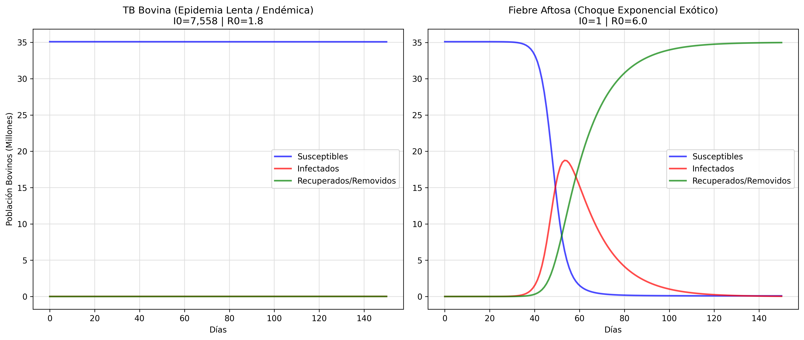

# Fundamentos Matemáticos: El Modelo SIR y Sistemas Complejos

> **"Comprender la dinámica de un sistema es tener el poder de alterarlo."**
> — Inspirado en los principios de modelado de sistemas complejos de DeepMind.

El universo, desde la propagación de un virus en una granja hasta la adopción de una nueva tecnología de Inteligencia Artificial, obedece a reglas de difusión. El modelo SIR no es solo "biología"; es la arquitectura fundamental de cómo _cualquier cosa_ se propaga a través de una red.

## 1. La Historia (Kermack y McKendrick, 1927)

En 1927, W. O. Kermack y A. G. McKendrick publicaron un paper que cambiaría la matemática aplicada. Venían de observar epidemias como la Peste de Londres o el Cólera. Se dieron cuenta de que no necesitaban simular a cada individuo; si miraban el sistema desde arriba, la población se dividía en "compartimentos" que fluían como líquidos en tuberías. 

Ahí nace el modelado compartimental. 

## 2. La Maquinaria Matemática (¿ODEs o PDEs?)

El modelo clásico SIR utiliza **Ecuaciones Diferenciales Ordinarias (ODEs)**, no Ecuaciones Diferenciales Parciales (PDEs). 

¿Cuál es la diferencia?
- **ODEs (Derivadas Ordinarias):** Asumen que todo está mezclado homogeneamente (como un vaso de agua con colorante). Solo derivas respecto al **tiempo** (dt). 
- **PDEs (Derivadas Parciales):** Miden el cambio respecto al tiempo "t" **y** al espacio "x, y". Si añades espacio (difusión de calor, o transmisión a través de fronteras de estados), usas PDEs. Para nuestro proyecto macro, usamos ODEs por simplicidad, asumiendo que el mercado de carne conecta la población completa a nivel nacional.

### El Sistema de Ecuaciones (El Motor)

Definimos tres compartimentos (variables de estado). La regla de oro es la "Conservación de la Población": la suma de las partes siempre es el todo (S + I + R = N).  

- **S (Susceptibles):** Los que pueden ser infectados.
- **I (Infectados):** Los que tienen el "virus" y pueden pasarlo.
- **R (Recuperados/Removidos):** Los que ya no participan (inmunidad, muerte o cuarentena).

Las ecuaciones en texto puro lineal (sin notación matemática compleja) son:

1. **Agotamiento de Susceptibles:** 
   dS/dt = -(beta * S * I) / N
   *(Los susceptibles disminuyen en proporción a los encuentros con infectados. "beta" es la tasa de transmisión).*

2. **Crecimiento de Infectados:**
   dI/dt = (beta * S * I) / N - (gamma * I)
   *(Entran nuevos infectados de S, pero salen los que se recuperan a una tasa "gamma").*

3. **Acumulación de Recuperados:**
   dR/dt = gamma * I
   *(Nota cómo lo que sale de los Infectados entra exactamente igual aquí).*

**Concepto Clave (R0):** El "Número Reproductivo Básico" es R0 = beta / gamma. Si R0 > 1, la derivada dI/dt es positiva al inicio y tienes una epidemia exponencial. Si R0 < 1, la epidemia muere antes de empezar.

---

## 3. Parametrización: ¿Cómo se calculan "beta" y "gamma"?

No tenemos que inventar o adivinar las tasas, la literatura y el álgebra básica hacen el trabajo por nosotros:

**A. Tasa de Recuperación (gamma)**
Es simplemente la inversa de los días que dura un animal infectado (Duración = D).
- Fiebre Aftosa: Dura unos 14 días. Entonces `gamma = 1 / 14`.
- Tuberculosis: Enfermedad lenta, dura meses (~180 días). `gamma = 1 / 180`.

**B. Tasa de Transmisión (beta)**
Como la definición de R0 es (beta / gamma), usando álgebra básica despejamos beta multiplicando R0 por gamma:
`beta = R0 * gamma`
La literatura nos da el R0 calculado de brotes anteriores (R0=6.0 para Aftosa, según Tildesley et al.). Pasándole a Python el R0 y los días, y despejando así de fácil, el modelo usa la tasa real empírica.

---

## 4. Integración Numérica: ¿Por qué usamos software en lugar de álgebra?

Si intentas despejar "S", "I" o "R" con álgebra tradicional para tener una "Fórmula Maestra Gigante", fallarás. Este sistema de ecuaciones diferenciales no lineales **no tiene solución analítica exacta**.

Para esto existe la "Integración Numérica" (y librerías como SciPy). Algoritmos como **Runge-Kutta** (inventados en 1901 y vitales en el desarrollo del programa espacial Apollo) no intentan tener un resultado mágico; toman su estado actual en el Día 0, calculan hacia donde apunta la pendiente en ese micro-momento, dibujan una pequeña línea avanzando al mañana (dx = diminuto), actualizan los números, recalcula la pendiente, y lo repiten millones de veces en segundos. Es simulación fuerza-bruta super-optimizada.

---

## 5. Zero-to-One: El Leverage Empresarial (Negocios y ML)

Pensar que el SIR solo sirve en epidemiología para vacas es un error. Este modelo es la arquitectura del **contagio de ecosistemas**.

- **Marketing Viral & SaaS:** "S" son clientes target. "I" son tus usuarios activos invitando a otros. "R" es el "Churn" (clientes que cancelaron y no volverán). Si el "R0 viral" (Viral Coefficient) (invitaciones enviadas * % de conversión) es > 1, creces hiper-exponencialmente sin pagar en marketing (Facebook, WhatsApp en su etapa temprana).
- **Machine Learning (Graph NNs):** En Ciberseguridad Cloud, se usan Graph Neural Networks entrenadas con métricas cuasi-SIR para predecir qué Servidor va a comprometerse por "zero-day malware" cuando salta entre clusters adyacentes.

---

## 6. La Bomba Económica: El Caso de Reino Unido (2001) y la justificación del Simposio

Para entender por qué el modelo simula un escenario donde $I_0 = 1$ (un solo animal infectado) genera una debacle total, miramos a la historia empírica. 

La Fiebre Aftosa **no es mortal para los humanos** (el riesgo zoonótico es casi cero), pero es una **arma de destrucción económica**. En un entorno comercial de hiper-velocidad, la variable de "Recuperados" ($R$) en el modelo SIR adopta un tono oscuro: significa **Rifle Sanitario (Sacrificio e Incineración)**. La industria no permite que un animal se recupere para esparcir el virus.

**El Choque del 2001 en el Reino Unido:**
- **Pérdida de Vida:** Se sacrificaron alrededor de **6 millones de animales** (vacas, cerdos y ovejas). Los cadáveres fueron incinerados en colosales piras al aire libre que traumatizaron a la población.
- **Daño Económico:** Costó a la economía británica más de **£8,000 millones de libras** (aproximadamente $12,000 millones de USD).
- **Efectos de Segundo Orden:** Las granjas y áreas rurales fueron puestas en bloqueos militares. Esto destruyó silenciosamente a la industria del **turismo rural y hotelero**, las cuales sufrieron pérdidas monetarias incluso mayores que el propio sector agrario.

Cualquier nación que reporte un solo caso pierde inmediatamente su estatus comercial internacional (OMSA), bloqueando billones de dólares en exportaciones.

---

## 7. Evidencia Gráfica: Salida de la Simulación SIR Dual

El código `src/models/sir_dual.py` procesa los datos reales ingeridos por el pipeline y expulsa este comparativo. 
*(Figura generada automáticamente a partir del motor de Ecuaciones Diferenciales Ordinarias del lado Python).*

* **Izquierda (TB Bovina):** Endémica y lenta. La simulación arranca con $I_0 = 7,558$ (las cuarentenas documentadas ocultas del SENASICA). Al ser $R_0 = 1.8$, el crecimiento es paulatino y se mantiene controlable a los 150 días.
* **Derecha (FMD):** La importación catastrófica ($I_0 = 1$). El parámetro empírico $R_0 = 6.0$ y un $\gamma = 1/14$ días produce una curva casi vertical (exponencial verdadera). A los 60 días, más de la mitad del sector agropecuario (18.7 millones) termina en estado Removido (extinto/sacrificado). 

Esta visualización ratifica matemáticamente por qué nuestro **Sistema de Vigilancia Unificado** (NoSQL / MongoDB) no es una extravagancia de software, sino un muro de contención económico de vital importancia a nivel nacional.
