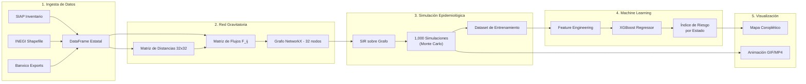

# Deep Research: Datos y Pipeline para Modelo Gravitatorio FMD

## Objetivo

Construir un **Modelo Gravitatorio Espacial de Propagación de FMD** en México, alimentado con datos reales, que produzca:

1. Un **Índice de Riesgo Macroeconómico por Estado** (predicción XGBoost).
2. Una **Animación temporal** (GIF/MP4) de la propagación simulada sobre el mapa de México.
3. Un **Mapa Coroplético estático** de vulnerabilidad sistémica.

---

## 1. Catálogo de Fuentes de Datos

### 1.1 Datos Nucleares (Imprescindibles)

| # | Dataset | Fuente | Portal | Formato | Método de Obtención | Uso en el Modelo |
|---|---------|--------|--------|---------|---------------------|------------------|
| 1 | **Inventario Bovino por Estado** (cabezas de ganado) | SIAP / SADER | [gob.mx/siap](https://www.gob.mx/siap) → Estadística Pecuaria | CSV / Excel | Descarga directa | **Masa gravitatoria** (P_i, P_j) |
| 2 | **Marco Geoestadístico Nacional** (polígonos de estados y municipios) | INEGI | [inegi.org.mx/temas/mg](https://www.inegi.org.mx/temas/mg/) → Descargas | Shapefile (.shp) | Descarga directa (ZIP) | Renderizado del mapa con GeoPandas |
| 3 | **Centroides geográficos** de los 32 estados | Derivado del Shapefile INEGI | Se calcula con `geopandas` | GeoJSON | `gdf.geometry.centroid` | **Distancia gravitatoria** (d_ij) |

### 1.2 Datos de Enriquecimiento (Alto Valor)

| # | Dataset | Fuente | Portal | Formato | Método de Obtención | Uso en el Modelo |
|---|---------|--------|--------|---------|---------------------|------------------|
| 4 | **Red Nacional de Caminos** (rutas troncales) | IMT / SICT | [datos.gob.mx](https://datos.gob.mx) → buscar "Red Nacional de Caminos" | Shapefile | Descarga directa | Reemplazar distancia euclidiana por **distancia real por carretera** (más realista) |
| 5 | **Rastros TIF** (ubicación de mataderos certificados) | SENASICA | [gob.mx/senasica](https://www.gob.mx/senasica) → Directorio TIF / [datos.gob.mx](https://datos.gob.mx) | CSV / Excel | Descarga o scraping del directorio | **Nodos atractores** en la red (los rastros concentran tráfico animal) |
| 6 | **Exportaciones bovinas por aduana/estado** | Banxico SIE / SIAP | [banxico.org.mx/SieInternet](https://www.banxico.org.mx/SieInternet/) → Partida arancelaria 0102 | CSV / Excel | Query en el Cubo de Comercio Exterior | **Peso económico** de cada estado (feature para XGBoost) |
| 7 | **Exportaciones EE.UU. ↔ México** (beef & cattle) | USDA FAS GATS | [apps.fas.usda.gov/gats](https://apps.fas.usda.gov/gats/default.aspx) → Advanced Query | CSV | Query interactiva + descarga | Validación cruzada de los datos de Banxico |

### 1.3 Datos Sutiles (Diferenciadores — Pocos investigadores los usan)

| # | Dataset | Fuente | Portal | Formato | Método de Obtención | Uso en el Modelo |
|---|---------|--------|--------|---------|---------------------|------------------|
| 8 | **Uso de Suelo y Vegetación** (pastizales = proxy de densidad ganadera) | CONABIO / INEGI Serie VII | [geoportal.conabio.gob.mx](http://geoportal.conabio.gob.mx/) → Vegetación y uso de suelo | Shapefile | Descarga directa | Feature espacial: % del estado cubierto por pastizales |
| 9 | **Brotes históricos mundiales de FMD** (georreferenciados) | WOAH (WAHIS) | [wahis.woah.org](https://wahis.woah.org/#/home) | Dashboard / CSV manual | Filtrar por "Foot and mouth disease" + descarga manual | Calibrar parámetros del modelo SIR y validar la velocidad de propagación |
| 10 | **Data México** — Comercio exterior visual | Secretaría de Economía | [datamexico.org](https://www.economia.gob.mx/datamexico/) | API / Dashboard | Descarga vía interfaz | Visualización complementaria de flujos comerciales |
| 11 | **Precipitación y Clima** (estrés hídrico → movimiento forzado de ganado) | CONAGUA / SMN | [smn.conagua.gob.mx](https://smn.conagua.gob.mx/es/) | CSV | Descarga de estaciones | Feature estacional: sequía → desplazamiento de ganado a otras regiones |
| 12 | **Censo Agropecuario 2022** (Unidades de Producción con ganado) | INEGI | [inegi.org.mx/programas/ca/2022](https://www.inegi.org.mx/programas/ca/2022/) | Microdatos (CSV) | Descarga directa | Número de **unidades productivas** por municipio (complementa al inventario SIAP) |
| 13 | **Ferias ganaderas y subastas** (puntos de mezcla animal) | CNOG / Uniones Ganaderas estatales | Sitios web individuales | Manual / Scraping | Investigación manual | Nodos de alto riesgo epidemiológico (mixing events) |

---

## 2. Metodología del Modelo Gravitatorio

### 2.1 La Fórmula Central

El flujo esperado de ganado entre el Estado _i_ y el Estado _j_ se calcula como:

```
F_ij = k * (P_i^alpha * P_j^beta) / d_ij^gamma
```

Donde:
- `F_ij` = Flujo estimado de animales del estado _i_ al estado _j_
- `P_i`, `P_j` = Inventario bovino (cabezas) de cada estado (Dato #1)
- `d_ij` = Distancia entre centroides (Dato #3) o distancia por carretera (Dato #4)
- `k` = Constante de proporcionalidad
- `alpha`, `beta` = Exponentes de masa (típicamente ~1.0)
- `gamma` = Exponente de fricción por distancia (típicamente ~2.0)

**Calibración:** Si tenemos datos de movimiento parcial (ej. exportaciones por aduana), podemos estimar los parámetros con Poisson Pseudo-Maximum Likelihood (PPML). Si no, usamos valores de la literatura (Tildesley et al., 2006; Keeling et al., 2001).

### 2.2 Pipeline Completo



### 2.3 ¿XGBoost en modo Regresión o Clasificación?

**Regresión.** La variable objetivo (`y`) será continua:

- **Opción A:** `y` = Días hasta que el 50% del hato nacional está infectado (dado un I₀ en el estado X).
- **Opción B:** `y` = Pérdida económica acumulada a 90 días (en Millones USD).
- **Opción C (Recomendada):** `y` = Índice de Riesgo Sistémico (0.0 a 1.0), calculado como la fracción del PIB ganadero nacional que colapsa si el brote inicia en ese estado.

Las **features** de entrada serán:
- Inventario bovino del estado origen
- Grado de conectividad en el grafo (centralidad)
- Distancia promedio a los top-5 estados ganaderos
- Número de rastros TIF
- Valor de exportaciones
- % de pastizal en uso de suelo

---

## 3. Visualización: La Animación de Propagación

### 3.1 Stack Técnico

```
GeoPandas + Matplotlib (FuncAnimation) → .gif o .mp4
```

### 3.2 Qué se verá

Frame 0: Mapa de México en verde/blanco. Un punto rojo aparece en el estado semilla (ej. Veracruz).
Frame 1-N: El rojo se expande a estados vecinos (ponderado por F_ij). La intensidad del color refleja el % de hato infectado. Una barra lateral muestra la pérdida económica acumulada en tiempo real.
Frame Final: Mapa completamente rojo/oscuro. Texto: "Pérdida total: $52,800M USD".

### 3.3 Archivos Necesarios

| Archivo | Fuente | Formato |
|---------|--------|---------|
| `00ent.shp` (polígonos estatales) | INEGI Marco Geoestadístico | Shapefile |
| `inventario_bovino_2024.csv` | SIAP | CSV |
| `distancias_estados.csv` | Calculado con GeoPandas | CSV |

---

## 4. Orden de Ejecución (Priorizado)

> [!IMPORTANT]
> **Paso 0 es bloqueante.** Sin el Shapefile y el inventario bovino, no podemos avanzar con nada más.

| Paso | Tarea | Tiempo Est. | Dependencias |
|------|-------|-------------|--------------|
| **0** | Descargar Shapefile INEGI + CSV inventario SIAP | 30 min | Ninguna |
| **1** | Construir `gravity_network.py` (matriz 32x32) | 2 hrs | Paso 0 |
| **2** | Implementar SIR sobre grafo + Monte Carlo | 2 hrs | Paso 1 |
| **3** | Generar animación GIF con GeoPandas | 2 hrs | Paso 2 |
| **4** | Feature engineering + entrenar XGBoost | 2 hrs | Paso 2 |
| **5** | Mapa coroplético final de riesgo | 1 hr | Paso 4 |
| **6** | Enriquecer con datos opcionales (Banxico, TIF, CONABIO) | Variable | Paso 4 |

---

## 5. Preguntas Abiertas (Para Decidir)

1. **¿Nivel estatal o municipal?** Estatal (32 nodos) es rápido y suficiente para la presentación. Municipal (2,469 nodos) es más granular pero computacionalmente más pesado.
2. **¿Cuántas simulaciones Monte Carlo?** 1,000 es un buen balance. 10,000 si queremos intervalos de confianza estrechos.
3. **¿Incluimos el efecto del gusano barrenador 2025?** Es un dato actual que podría enriquecer la narrativa (México perdió 50-70% de exportaciones bovinas este año por otra emergencia sanitaria).
