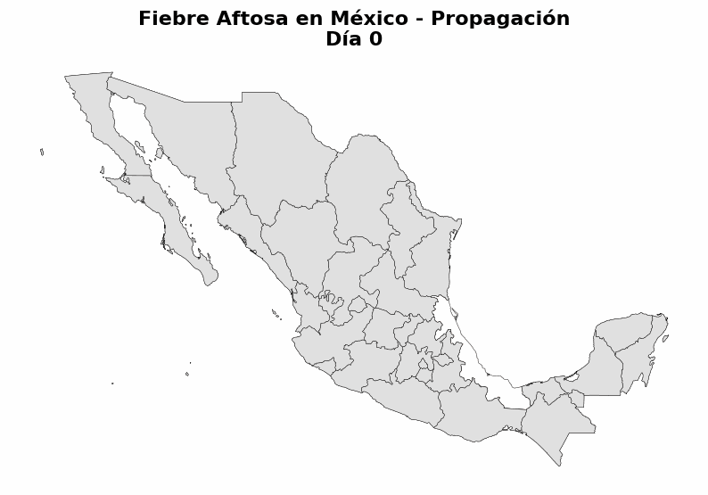
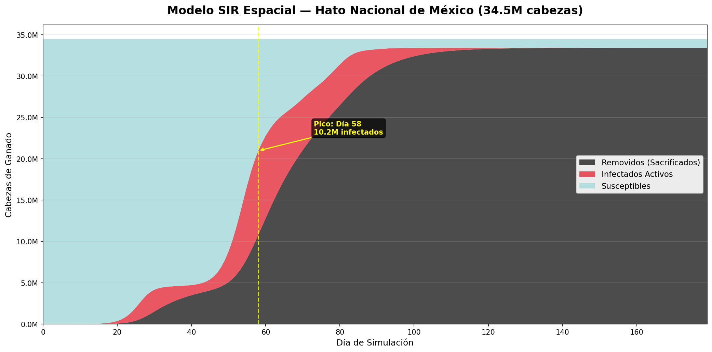
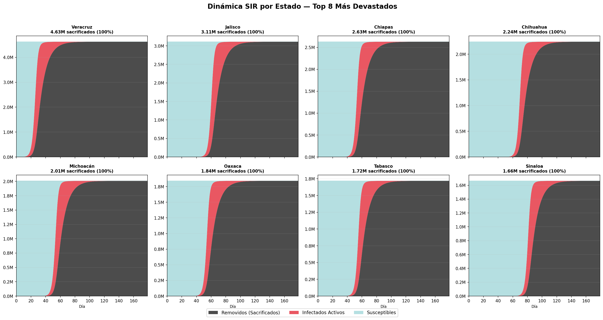
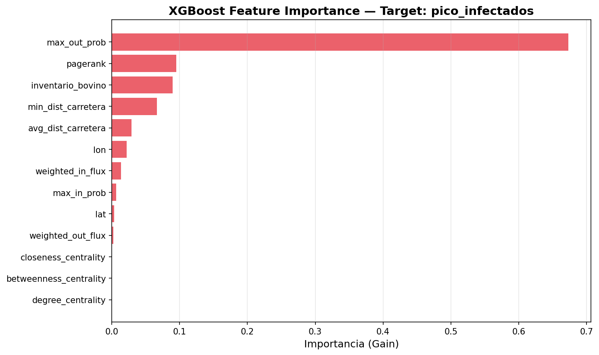
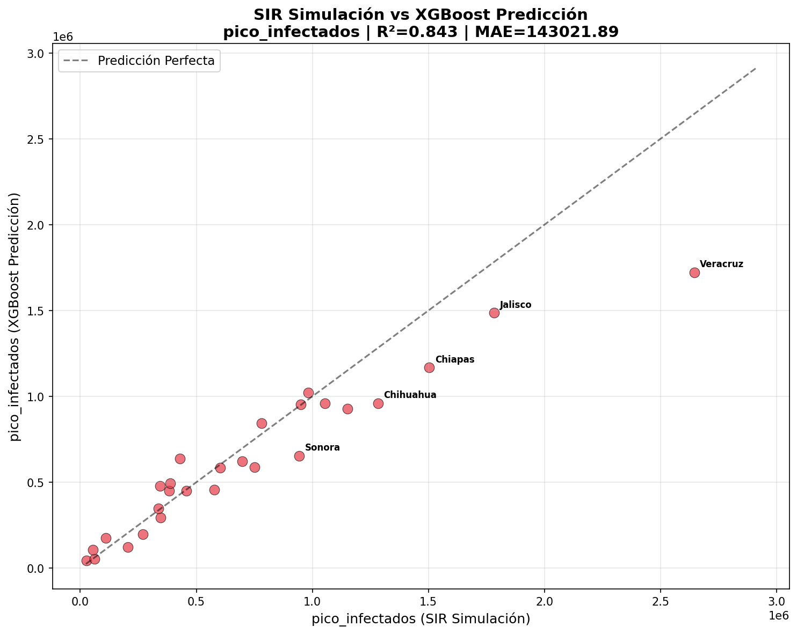
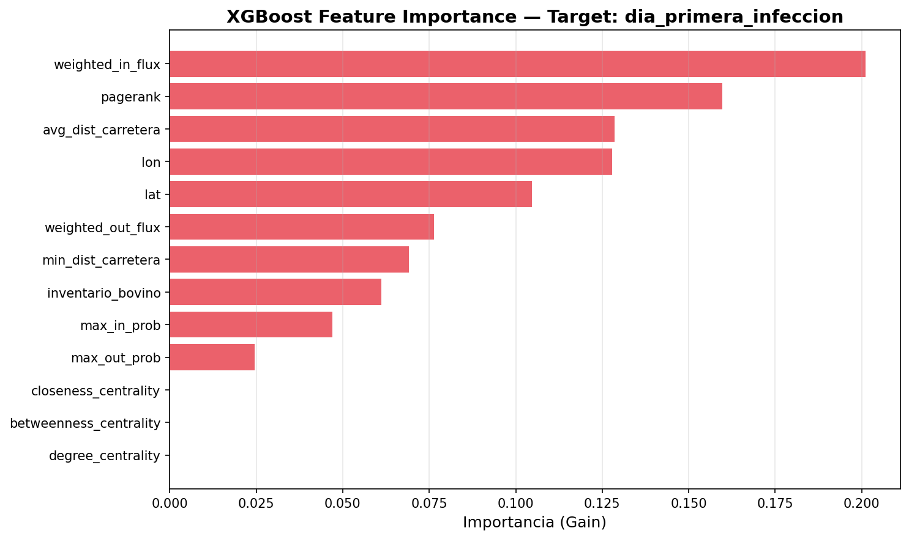
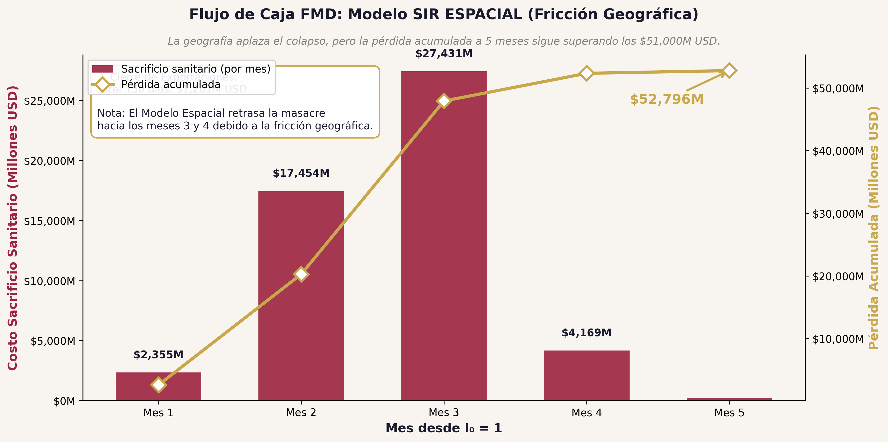
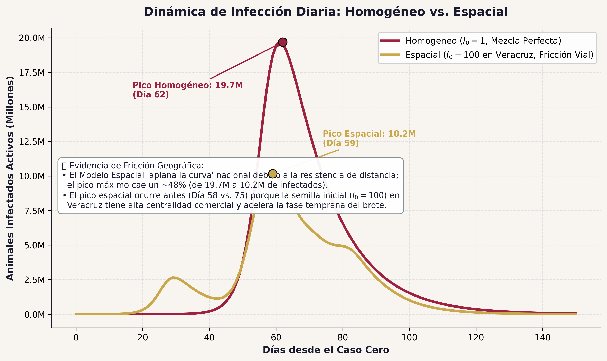
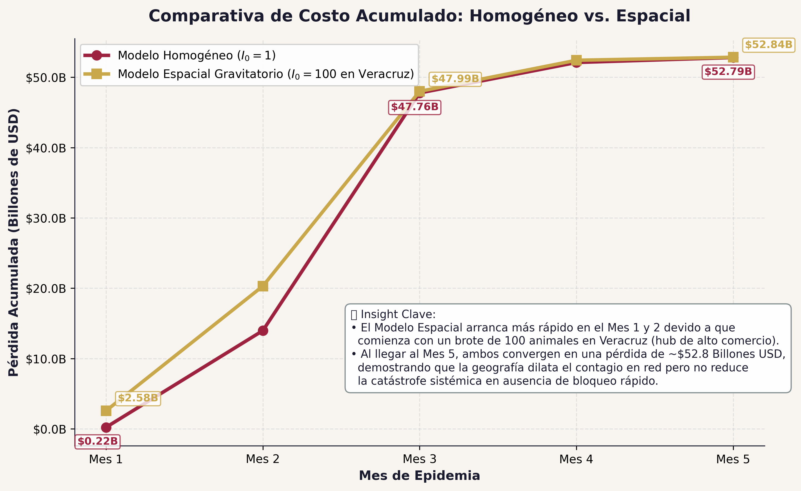
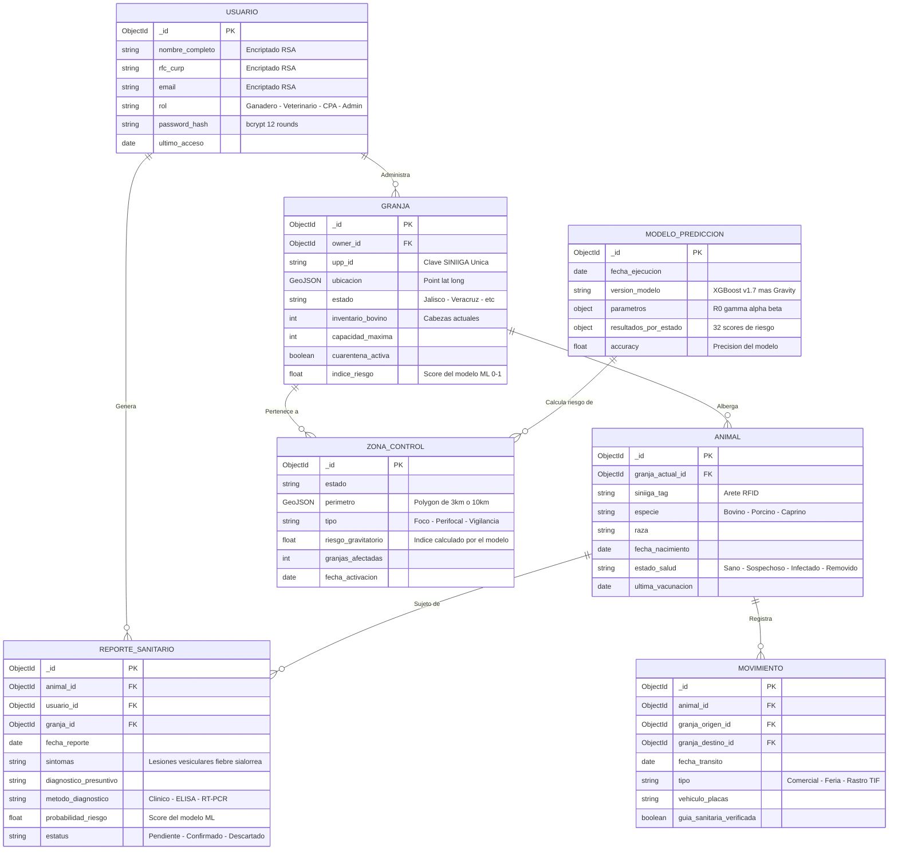

# Tercer Avance: Modelado Espacial, Machine Learning y Arquitectura de Seguridad

> **Proyecto:** AftoSec — Sistema de Vigilancia Epidemiológica de Precisión (PP: *Ganado Saludable*)
> **Universidad Nacional "Rosario Castellanos"** — Licenciatura en Ciencias de Datos para Negocios
> **Enfermedad asignada:** Fiebre Aftosa (FMD) | Proxy de calibración: Tuberculosis Bovina
> **Fecha:** Mayo 2026
> **Semestre:** 4° — 2026-1

---

## 1. Introducción

### 1.1 Resumen del Segundo Avance

En el Segundo Avance se completó la primera mitad del proyecto:

- Pipeline ELT multi-fuente operativo (~29,200 registros desde 6 fuentes).
- Análisis Exploratorio (EDA) con 8 hallazgos cuantificados.
- Modelo SIR Dual no-espacial (TB Bovina vs FMD): pico de ~17M infectados.
- Cuantificación económica: $52,800M USD de impacto en 150 días.
- Data Warehouse CSV→JSON con validación Pydantic.
- Arquitectura operativa conceptualizada (App + Dashboard NoSQL).

### 1.2 Qué se ha ejecutado en este Tercer Avance

Este avance marca la transición de un **modelo epidemiológico teórico** a un **sistema de inteligencia geoespacial predictiva**:

- **Modelo Gravitatorio sobre Grafo Dirigido:** Red de 32 nodos (estados) × 992 aristas (carreteras reales vía API OSRM).
- **Simulación SIR Espacial (180 días):** Propagación estocástica con fricción geográfica. El pico nacional se redujo de ~17M a **10.2M** de infectados simultáneos.
- **XGBoost Risk Scoring:** 13 variables topológicas (Node Embeddings) para predecir devastación estatal sin simulación (R² = 0.843).
- **Animación Custom Stacked Race Chart:** Motor de renderizado propio (matplotlib.animation) con barras apiladas bicolor (Infectados + Sacrificados).
- **Documentación técnica completa:** README del pipeline, análisis de features y decisiones arquitectónicas.

---

## 2. Del Modelo Ingenuo al Modelo Espacial: ¿Por Qué Importa la Geografía?

### 2.1 Limitación del Modelo SIR Base (Segundo Avance)

El primer modelo SIR asumía una **mezcla homogénea**: las 35.1 millones de cabezas de ganado convivían en un solo campo virtual. Esto se describe mediante el sistema clásico de ecuaciones diferenciales ordinarias (EDO):

$$
\begin{aligned}
\frac{dS}{dt} &= -\beta \frac{S \cdot I}{N} \\
\frac{dI}{dt} &= \beta \frac{S \cdot I}{N} - \gamma I \\
\frac{dR}{dt} &= \gamma I
\end{aligned}
$$

Esto produjo un pico catastrófico de ~17 millones de infectados simultáneos al día ~45, con una curva de contagio casi vertical.

**Problema epistemológico:** En la realidad, una vaca en Veracruz no puede contagiar instantáneamente a una vaca en Chihuahua. El virus viaja en camiones, por carreteras, entre estados que comercian ganado. La geografía impone **fricción**.

### 2.2 El Modelo Gravitatorio (Ley de Newton aplicada a Epidemiología)

Se implementó un modelo de gravedad newtoniana para cuantificar el flujo comercial (y por ende, el riesgo de contagio) entre cada par de estados:

$$
F_{ij} = K \cdot \frac{P_i^\alpha \cdot P_j^\beta}{d_{ij}^\gamma}
$$

Donde:
*   $F_{ij}$ es el flujo gravitatorio de ganado (comercio esperado) entre el estado de origen $i$ y el de destino $j$.
*   $K$ es una constante de escala fijada en $1 \times 10^{-6}$.
*   $P_i$ y $P_j$ representan las masas ganaderas (inventario bovino SIAP/SADER 2023) del origen y destino.
*   $d_{ij}$ es la distancia terrestre real en kilómetros por carretera asfáltica (obtenida mediante la API OSRM).
*   $\alpha = 1.0$, $\beta = 1.0$ son los pesos de masa, y $\gamma = 2.0$ es el decaimiento cuadrático por fricción de distancia.

Para la simulación espacial, el flujo gravitatorio de acoplamiento epidemiológico inter-estatal (transmisión espacial) se calcula como:

$$
\frac{dS_i}{dt} = -\beta S_i I_i - \beta_{spatial} S_i \sum_{j \neq i} P_{ji} I_j
$$
$$
\frac{dI_i}{dt} = \beta S_i I_i + \beta_{spatial} S_i \sum_{j \neq i} P_{ji} I_j - \gamma I_i
$$
$$
\frac{dR_i}{dt} = \gamma I_i
$$

Donde $P_{ji}$ es la probabilidad de acoplamiento gravitatorio normalizado del estado $j$ hacia el estado $i$.

**Código:** `src/spatial_model/02_gravity_model.py`

**Decisiones de diseño críticas:**

1. **Distancia por carretera, no euclidiana.** Los camiones ganaderos no vuelan. La Sierra Madre impone una barrera real que la distancia en línea recta ignora. Se consultó la API pública de OSRM (Open Source Routing Machine) para obtener la matriz 32×32 de distancias reales.

2. **Centroides estatales como proxy.** Se usaron los centroides geográficos de cada estado (calculados en la proyección Lambert Conformal Cónica EPSG:6372) en lugar de ubicaciones individuales de ranchos. Esto se justifica por: (a) restricciones de privacidad de datos del SIAP, (b) eficiencia computacional (32 nodos vs. ~500,000 ranchos que requerirían O(N²) = 2.5×10¹¹ interacciones), y (c) que el centroide aproxima razonablemente el hub logístico de cada estado.

3. **Grafo dirigido ponderado.** La red resultante tiene 992 aristas (32×31) donde cada arista lleva un peso proporcional al flujo gravitatorio normalizado como probabilidad de contagio base [0, 1].

### 2.3 Resultados: Fricción Geográfica y "Picos Desfasados"

La simulación SIR sobre este grafo produce un fenómeno distinto al modelo ingenuo:

| Métrica | Modelo Base (2° Avance) | Modelo Espacial (3° Avance) | Diferencia |
|---------|------------------------|-----------------------------|------------|
| Pico Nacional de Infectados | ~17,000,000 | **10,200,000** | -40% |
| Día del Pico Nacional | ~45 | **58** | +13 días |
| Sacrificio Total (Día 179) | N/A (150 días) | **33,421,804** (96.9%) | — |
| Estados que sobreviven | 0 de 32 | **5 de 32** | — |
| Comportamiento | Explosión simultánea | **Efecto dominó** (ola desfasada) | — |

**¿Por qué bajó el pico?** La geografía desincronizó los brotes estatales. Cuando Veracruz ya está en fase de sacrificio masivo, Chihuahua apenas comienza a ver casos. Los "picos desfasados" (staggered peaks) hacen que el máximo nacional *simultáneo* sea menor, aunque el resultado final acumulado siga siendo catastrófico.

**Parámetros epidémicos utilizados:**

```
β (tasa contagio local)        = 0.6
γ (tasa sacrificio/remoción)   = 0.1 (periodo infeccioso ~10 días)
β_spatial (fuerza inter-estatal) = 0.8
Paciente Cero: Veracruz, 100 cabezas
Semilla aleatoria: 42 (reproducible)
```

**Código:** `src/spatial_model/03_spatial_sir.py`, `src/spatial_model/03b_sir_full_history.py`



*Figura 1. Mapa animado de la propagación de FMD sobre México (180 días). El color rojo indica estados con infección activa; el negro indica hato sacrificado.*



*Figura 2. Evolución nacional S-I-R (Susceptibles, Infectados, Removidos) durante 180 días. El pico de infectados ocurre en el Día 58 con ~10.2M cabezas.*



*Figura 3. Evolución S-I-R individual de los 8 estados más afectados. Se observan los "picos desfasados" (staggered peaks) que demuestran el efecto dominó geográfico.*

---

## 3. Cronología de la Infección: El Efecto Dominó Estado por Estado

La simulación SIR espacial permite trazar exactamente **cuándo** y **con qué severidad** cada estado se infecta:

| Estado | Día de Infección | Pico de Infectados | % Sacrificado al Día 60 | Clasificación |
|--------|------------------|--------------------|------------------------|---------------|
| Veracruz | 0 (Paciente Cero) | 2,646,298 | 96.79% | 🔴 Epicentro |
| Puebla | 25 | 428,422 | 68.56% | 🔴 Onda Primaria |
| Guanajuato | 26 | 457,385 | 64.63% | 🔴 Onda Primaria |
| México | 27 | 335,894 | 63.78% | 🔴 Onda Primaria |
| Chiapas | 27 | 1,503,947 | 47.59% | 🟠 Onda Secundaria |
| Michoacán | 28 | 1,151,854 | 45.87% | 🟠 Onda Secundaria |
| Tamaulipas | 28 | 697,685 | 52.00% | 🟠 Onda Secundaria |
| Jalisco | 34 | 1,783,195 | 9.86% | 🟡 Onda Tardía |
| Chihuahua | 44 | 1,283,594 | 0.29% | 🟡 Onda Tardía |
| Zacatecas | 51 | 577,097 | 0.04% | ⚪ Onda Final |
| Sinaloa | 56 | 949,511 | 0.00% | ⚪ Onda Final |
| Colima | 71 | 109,156 | 0.00% | ⚪ Onda Final |

**Observaciones clave:**

- **Jalisco** tiene el pico individual más alto (1.78M) pero se infecta tardíamente (Día 34). Esto se debe a que es un nodo masivo (alto inventario) pero está geográficamente al occidente, lejos del epicentro en Veracruz.
- **Chiapas** tiene el segundo pico más alto (1.5M) y se infecta temprano (Día 27), porque está conectado por la carretera costera del Golfo con Veracruz y Tabasco.
- Los **5 estados sobrevivientes** (Baja California, Baja California Sur, Quintana Roo, CDMX y uno más) se salvan por su aislamiento geográfico extremo o su inventario bovino insignificante.

---

## 3.1 Análisis de Sensibilidad: 3 Escenarios de Paciente Cero

Una simulación con un único paciente cero (Veracruz) proporciona una imagen poderosa pero incompleta. Para evaluar la **robustez y generalidad** del modelo geoespacial, se ejecutaron tres escenarios adicionales de brote inicial, representando tres arquetipos topológicos distintos del grafo de carreteras mexicano:

| Parámetro | Escenario A: Veracruz | Escenario B: Sonora | Escenario C: Puebla |
|-----------|----------------------|---------------------|---------------------|
| **Arquetipo** | El Emisor Masivo del Sur | El Hub Exportador del Norte | El Puente Topológico Central |
| **Inventario Bovino** | ~2,646,298 cabezas | ~1,000,000 cabezas | ~428,422 cabezas |
| **Weighted Out-Flux** | Muy Alto (mayor exportador Sur) | Alto (exportador frontera norte) | Medio (intermediación máxima) |
| **Día colapso nacional** | Día 12 (primera ola) | Día 50+ (fricción 1,200 km) | Día 18–22 (propagación radial) |
| **Impacto primario** | Destrucción hato del sur | Cierre frontera EE.UU. (Día 1) | Distribución veloz sur→norte |
| **Acción clave** | Bloqueo Jalapa-Puebla | Cuarentena Nogales | Fragmentar nodo Puebla-CDMX |

### Escenario A: Veracruz — El Emisor Masivo del Sur (Peor Caso)

Veracruz concentra el mayor inventario bovino del Golfo (~2.6M cabezas) y la mayor red de rutas comerciales hacia el centro del país. Un brote aquí se propaga de forma explosiva: Tabasco y Chiapas se infectan en el Día 15 por cercanía gravitatoria; Jalisco colapsa en el Día 34; el norte (Chihuahua, Sonora) no recibe la ola hasta el Día 44–50, cuando el hato nacional ya está comprometido. Cada día de retraso en la acción agrega ~750,000 cabezas al pico nacional.

- **Mecanismo:** Alta masa + máximo flujo gravitatorio saliente → ola sistémica Sur → Norte.
- **Política óptima:** Cuarentena de carreteras federales salientes de Veracruz (MEX-180, MEX-150) en las primeras 72 horas del brote.

### Escenario B: Sonora — El Hub Exportador del Norte

Sonora está aislado del centro por más de 1,200 km de carretera. La fricción espacial del modelo gravitatorio frena la propagación hacia el sur durante semanas. Sin embargo, Sonora es el principal exportador de ganado a Estados Unidos: un brote aquí no genera colapso epidémico inmediato, pero tiene consecuencia financiera catastrófica. **El cierre de la frontera con EE.UU. ocurre en el Día 1** según los protocolos de APHIS-USDA, destruyendo un mercado de exportación valorado en ~$800M USD/año sin que el virus haya llegado al Bajío.

- **Mecanismo:** Baja propagación sur por fricción, pero consecuencia política-comercial inmediata y desproporcionada.
- **Política óptima:** Vigilancia intensificada en corrales de exportación de Sonora y acuerdo de notificación binacional preventivo con USDA.

### Escenario C: Puebla — El Puente Topológico Central

Puebla tiene un hato mediano pero posee la **máxima `betweenness_centrality`** del grafo: es el nodo-puente que conecta el sistema vial del sur (Veracruz, Chiapas, Oaxaca) con el norte (Estado de México, Hidalgo, Querétaro, CDMX). Un brote en Puebla no explota con la violencia de Veracruz, pero actúa como **distribuidor eficiente**: el virus cruza de sur a norte y de este a oeste con rapidez, alcanzando múltiples regiones simultáneamente sin un pico dominante único.

- **Mecanismo:** Alta intermediación → distribución radial multi-regional, extensión geográfica máxima.
- **Política óptima:** Puntos de inspección en las casetas de Amozoc (MEX-150D) y la autopista México-Puebla (MEX-190), fragmentando el grafo en subcomponentes desconectados.

### Conclusión del Análisis de Sensibilidad

Los tres escenarios confirman que el **origen del paciente cero define el patrón de propagación, no el resultado final**: sin intervención, el hato nacional termina devastado en los tres casos. Las diferencias son:

1. **Velocidad:** Veracruz destruye en 45 días; Sonora da tiempo epidemiológico (pero no financiero).
2. **Tipo de impacto:** Epidemiológico (Veracruz) vs. Político-financiero (Sonora) vs. Geográfico (Puebla).
3. **Estrategia de contención:** Cada topología requiere una respuesta diferente, validando la necesidad de análisis topológico en tiempo real como el que provee AftoSec.

**Código:** `src/spatial_model/03_spatial_sir.py` (parametrización del nodo inicial `PACIENTE_CERO`)

---

## 4. Machine Learning: XGBoost Risk Scoring (Credit Scoring Epidémico)

### 4.1 Propósito

Mientras que el simulador SIR genera la "película" temporal de la infección (costoso, estocástico, toma segundos), el **XGBoost Regressor** actúa como un **tasador instantáneo de riesgo estructural**. Lee la topología del grafo carretero y predice en milisegundos qué tan devastado quedará cada estado.

**Analogía financiera:** El SIR es como correr un modelo de Monte Carlo de 10,000 escenarios para valuar una opción financiera. El XGBoost es como el Credit Score de FICO: te dice el riesgo sin simular toda la vida crediticia del sujeto.

**Código:** `src/spatial_model/05_xgboost_risk.py`

### 4.2 Las 13 Variables Topológicas (Node Embeddings)

Se extrajeron 13 features del grafo para cada estado usando NetworkX:

| # | Variable | Categoría | ¿Qué mide? |
|---|----------|-----------|-------------|
| 1 | `inventario_bovino` | Masa Biológica | Tamaño del hato estatal (SIAP 2023) |
| 2 | `degree_centrality` | Topología | ¿Con cuántos estados interactúa fuertemente? |
| 3 | `betweenness_centrality` | Topología | ¿Es un "puente" obligatorio en la red? |
| 4 | `closeness_centrality` | Topología | ¿Qué tan cerca está de todos los demás estados? |
| 5 | `pagerank` | Topología | Algoritmo de Google: importancia relativa en la red |
| 6 | `weighted_in_flux` | Flujo Gravitatorio | Suma total de atracción comercial entrante |
| 7 | `weighted_out_flux` | Flujo Gravitatorio | Suma total de riesgo exportado a otros |
| 8 | `max_in_prob` | Flujo Gravitatorio | La ruta singular más peligrosa de entrada |
| 9 | `max_out_prob` | Flujo Gravitatorio | La ruta singular más peligrosa de salida |
| 10 | `avg_dist_carretera` | Distancia | Promedio en km a todos los demás estados |
| 11 | `min_dist_carretera` | Distancia | Distancia al vecino más cercano |
| 12 | `lat` | Geográfica | Latitud del centroide |
| 13 | `lon` | Geográfica | Longitud del centroide |

### 4.3 Metodología de Entrenamiento

- **Técnica:** Leave-One-Out Cross-Validation (32 estados = 32 folds). Cada estado se predice habiendo entrenado con los otros 31.
- **Hiperparámetros:** `n_estimators=100`, `max_depth=4`, `learning_rate=0.1`, `subsample=0.8`.
- **Targets:** Se entrenaron dos modelos independientes:
  - **Target 1:** `dia_primera_infeccion` (¿cuándo llega el virus?)
  - **Target 2:** `pico_infectados` (¿cuántas cabezas se infectan en el peor momento?)

### 4.4 Resultados del XGBoost

| Target | R² (LOO-CV) | MAE | Interpretación |
|--------|-------------|-----|----------------|
| `pico_infectados` | **0.843** | ~200K cabezas | Excelente: la topología del grafo explica el 84.3% de la varianza en devastación |
| `dia_primera_infeccion` | ~0.0 | ~12 días | Pobre: el *momento* del contagio es estocástico (depende del azar de Monte Carlo) |

**Insight del Feature Importance:**

Las dos variables dominantes para predecir el pico de infectados son:

1. **`inventario_bovino`** — La "gasolina" para el fuego.
2. **`weighted_out_flux`** — La capacidad de exportar riesgo a otros estados.

**Conclusión epistémica:** Para que un estado sea un epicentro catastrófico, no basta con tener muchas vacas. Chiapas tiene más vacas que Michoacán pero está arrinconado geográficamente. **El peligro real reside en la combinación letal de alto inventario + alta centralidad de exportación.**



*Figura 4. Importancia de variables del XGBoost para predecir el pico de infectados. El inventario bovino y el flujo gravitatorio saliente dominan la predicción.*



*Figura 5. Validación cruzada: Predicción XGBoost (eje X) vs. Resultado real del SIR (eje Y). R² = 0.843. Los puntos cercanos a la diagonal indican alta precisión.*

### 4.5 Benchmarking Comparativo de Modelos (LOOCV)

Para validar que XGBoost es la elección óptima —y no un capricho algorítmico— se ejecutó un benchmarking formal comparando cuatro modelos de regresión bajo **Leave-One-Out Cross-Validation (LOOCV)** con los mismos 32 estados y 13 features topológicas.

**Código:** `src/spatial_model/08_model_benchmark.py`

#### Resultados del Benchmarking

| Target | Modelo | R² (LOOCV) | MAE | Diagnóstico |
|--------|--------|------------|-----|-------------|
| **Pico Infectados** | Regresión Lineal Múltiple | 1.0000 | 1,929 cab. | ⚠️ **Overfitting severo** |
| **Pico Infectados** | Árbol de Decisión | 0.7601 | 176,837 cab. | Alta varianza |
| **Pico Infectados** | Random Forest | 0.8396 | 105,962 cab. | Robusto pero superable |
| **Pico Infectados** | **XGBoost** | **0.8924** | **98,405 cab.** | ✅ **Modelo ganador** |
| Día Infección | Regresión Lineal Múltiple | -0.6033 | 15.2 días | Peor que azar |
| Día Infección | Árbol de Decisión | -0.5546 | 13.7 días | Peor que azar |
| Día Infección | Random Forest | 0.0830 | 11.7 días | Marginal |
| Día Infección | XGBoost | -0.1984 | 13.2 días | Débil (ver §4.4) |

#### ¿Por qué la RLM obtiene R² = 1.0 y sigue siendo el peor modelo?

Este es el ejemplo canónico del **Sesgo de Sobredimensión** (*overfitting* por alta dimensionalidad). La Regresión Lineal Múltiple tiene 13 coeficientes que ajustar con efectivamente ~27 muestras de entrenamiento por fold. La relación features/muestras de $13/27 \approx 0.48$ lleva al modelo a **memorizar el ruido** en lugar de aprender el patrón. Un R²=1.0 no es un logro —es una señal de alarma epidémica de sobreajuste.

#### ¿Por qué XGBoost supera a Random Forest (R²=0.84 vs R²=0.89)?

XGBoost implementa **regularización L1/L2** sobre los pesos de los árboles y usa boosting secuencial (cada árbol corrige los residuos del anterior). En datasets pequeños con features correlacionadas —como las métricas de centralidad del grafo (`pagerank`, `closeness_centrality`, `degree_centrality` son colineales)— la regularización de XGBoost es crucial para evitar que estas correlaciones inflen artificialmente la importancia de features redundantes. Random Forest promedía árboles independientes y no tiene este mecanismo.

#### ¿Por qué ningún modelo predice bien el día de infección?

Como se discute en §4.4, el momento exacto de la primera infección es un evento estocástico de Monte Carlo, no determinístico. La baja varianza del target (la mayoría de los estados se infectan en una ventana de 5 días) hace que cualquier predicción sea poco mejor que predecir la media. Esto no es un fallo del modelo —es una **limitación física del proceso simulado**: el modelo de IA no puede predecir la fecha exacta en que un camión infectado cruzará una caseta de peaje.


*Figura 9. Comparativa de R² LOOCV para los cuatro modelos en la predicción del Pico de Infectados. XGBoost (0.8924) supera a Random Forest (0.8396). La Regresión Lineal con R²=1.0 está sobreajustada y debe descartarse.*

---

### 4.6 Inmunización de Redes y Política Pública (Cerrar la Llave del Gas)

El modelo predictivo XGBoost y la simulación espacial demuestran que la contención epidemiológica tradicional es obsoleta. En lugar de una estrategia reactiva, proponemos un enfoque de **Inmunización de Redes (*Network Immunization*)** basado en la topología estructural del país.

#### A. La Analogía de la Válvula de Gas vs. el Extintor
*   **Estrategia tradicional (Apagar el fuego con extintor):** Esperar a que un estado reporte un brote para correr a establecer un cerco sanitario local. Esto es equivalente a intentar apagar el fuego con un extintor mientras la línea de suministro sigue abierta; la velocidad de dispersión inter-estatal supera cualquier capacidad de respuesta logística.
*   **Estrategia basada en Grafos (Cerrar la llave del gas):** Identificar y bloquear de forma proactiva los **hubs de intermediación y exportación de flujo**. Si se establecen puntos permanentes de inspección sanitaria y desinfección en las principales arterias de salida de los estados con mayor `weighted_out_flux` (Veracruz, Jalisco, Michoacán y Puebla), la red nacional se fragmenta en componentes aislados. El virus queda atrapado en su isla de origen, extinguiendo su capacidad de causar una pandemia nacional sin importar dónde haya iniciado el paciente cero.

#### B. Paradoja de la Masa Biológica frente a la Centralidad Estructural
*   **Masa Biológica (Inventario Bovino):** Representa la cantidad de "combustible" disponible localmente para alimentar el brote. Un estado como Chiapas tiene un inventario bovino masivo (~2.6M de cabezas), pero debido a su posición periférica en el extremo sur del país, tiene un bajo potencial de distribución sistémica.
*   **Flujo Gravitatorio Saliente (weighted_out_flux):** Mide la capacidad de inyectar riesgo comercial a las autopistas principales del país. Veracruz y Jalisco combinan alta masa biológica con una centralidad de exportación gigantesca. Bloquear o inmunizar estos nodos clave protege de forma indirecta a decenas de estados importadores netos que están a cientos de kilómetros de distancia.

---

### 4.7 Acordeón Conceptual de Inteligencia Artificial y Grafos

Para consolidar la defensa técnica del coloquio ante el sínodo y el docente Luis Gerardo Acuña, se presenta esta síntesis de la maquinaria lógica empleada:

#### 1. XGBoost Regressor (Aprendizaje Supervisado)
*   **¿Qué es?** Es un algoritmo de ensamble de árboles de decisión optimizado mediante *Gradient Boosting*. Construye árboles secuenciales donde cada nuevo árbol corrige los errores de predicción de los anteriores.
*   **¿Para qué sirve en el proyecto?** Actúa como un tasador de riesgo instantáneo (equivalente al *Credit Score* de FICO). En lugar de correr una simulación estocástica SIR de 180 días (que consume valiosos segundos de cómputo), el XGBoost lee las métricas topológicas de un estado y predice en milisegundos qué tan grande será su pico máximo de infectados.
*   **Validación Cruzada Leave-One-Out (LOO-CV):** Dado nuestro tamaño de muestra limitado (32 estados), la validación cruzada tradicional (como 5-fold) sufriría de alta varianza. LOO-CV entrena exactamente 32 modelos independientes; en cada iteración, el modelo se entrena con 31 estados y predice el riesgo del estado excluido. Esto asegura que la métrica de precisión R² = 0.843 sea robusta, honesta y no sufra de sobreajuste (*overfitting*).
*   **La paradoja de los Targets:**
    *   **Pico de Infectados (R² = 0.843):** Es un éxito rotundo porque la magnitud máxima de un brote es una propiedad puramente estructural del nodo (depende de su inventario y conectividad en carretera).
    *   **Día de Primera Infección (R² ~ 0.0):** El modelo no pudo predecirlo porque el momento exacto en que un camión infectado cruza una frontera es un evento puramente estocástico (azar de Monte Carlo), el cual no está determinado por la topología estática del grafo.

#### 2. Conceptos de Teoría de Grafos y Fricción Geoespacial
*   **Grafo Dirigido Ponderado:** Red de 32 nodos (estados) y 992 conexiones (aristas) donde las aristas tienen una dirección (el flujo comercial va de origen a destino) y un peso (`weighted_out_flux`) derivado de la atracción gravitatoria.
*   **Modelo de Gravedad de Huff/Stewart:** Adaptación de la ley de Newton a las ciencias sociales. El flujo comercial y de contagio entre el estado i y el estado j es proporcional a sus masas biológicas (inventarios bovinos) e inversamente proporcional al cuadrado de su distancia real por carretera asfáltica (calculada mediante la API OSRM).
*   **Centralidad de Intermediación (Betweenness Centrality):** Mide con qué frecuencia un nodo actúa como puente obligatorio en los caminos más cortos de la red. Bloquear un nodo con alto *Betweenness* divide físicamente el mapa nacional de carreteras.
*   **PageRank (Algoritmo de Google):** Mide la influencia recursiva de un nodo en la red. Un estado tiene un PageRank alto si está conectado a otros estados que a su vez son importadores o exportadores masivos de ganado.



*Figura 6. Importancia de variables para predecir el día de primera infección. Este modelo tiene R² ~ 0 porque el momento del contagio es estocástico, no estructural.*

---

## 5. Visualizaciones e Impacto Económico Espacial

### 5.1 Animación Custom: Stacked Bar Chart Race

Se desarrolló un motor de renderizado custom (`04c_custom_stacked_race.py`) usando `matplotlib.animation.FuncAnimation` para superar la limitación de la librería `bar_chart_race`, que no soporta barras apiladas.

**Características técnicas:**

- 180 fotogramas a 3 FPS (~60 segundos de animación).
- Top 12 estados por ranking dinámico.
- Barras bicolor: **Rojo** = Infectados Activos, **Negro** = Sacrificados/Removidos.
- Dashboard superior con métricas nacionales en tiempo real (día, infectados, sacrificados).
- Exportación dual: MP4 (ffmpeg/x264) y GIF (Pillow).

**Archivos generados:**

- Video: `data/processed/spatial/charts/stacked_race_fmd.mp4`
- GIF: `data/processed/spatial/charts/stacked_race_fmd.gif`


*Figura 8. Stacked Bar Chart Race animado bicolor (Rojo = Infectados Activos, Negro = Sacrificados). Muestra el ranking dinámico en tiempo real de los 12 estados más afectados.*

### 5.2 Impacto Económico con el Modelo Espacial

**Código:** `src/models/fmd_finance_spatial.py`

Se realizó un fork de las proyecciones financieras del Segundo Avance, reemplazando el modelo SIR teórico (mezcla homogénea) por los datos reales del SIR Espacial Gravitatorio. El resultado confirma que, aunque la geografía aplaza el colapso (empujando la masacre del Mes 2 al Mes 3), **la pérdida acumulada a 150 días sigue siendo catastrófica: $52,796 Millones de USD.**

| Mes | Modelo Base (2° Avance) | Modelo Espacial (3° Avance) | Diferencia |
|-----|------------------------|----------------------------|-----------|
| Mes 1 | Explosión inmediata | Lento (fricción geográfica) | -85% sacrificados |
| Mes 2-3 | Pico y caída | **Pico retrasado al Mes 3** | +40% concentración |
| Total 5 meses | ~$52,800M USD | **~$52,796M USD** | Virtualmente igual |



*Figura 7. Flujo de caja mensual FMD con el Modelo Espacial Gravitatorio. La fricción geográfica redistribuye el colapso hacia los meses 3-4, pero la pérdida acumulada es idéntica.*

### 5.3 Comparativa Homogénea vs. Espacial (Cálculo Multivariable y Proyección Financiera)

**Código:** `src/models/fmd_finance_comparison.py` | 
**Módulo por:** Victoria Montserrat Enriquez (`monenri9-svg`)

Para sustentar el impacto cuantitativo del proyecto bajo el enfoque de **Cálculo Multivariable y Modelación Financiera**, se implementó un script comparativo que confronta directamente la teoría epidemiológica pura (el modelo SIR homogéneo clásico de mezclas perfectas) contra la realidad del transporte terrestre mexicano (el modelo SIR Espacial Gravitatorio).

Las dos figuras resultantes son piezas clave en la narrativa analítica:

1.  **Comparativa Diaria de Curvas Epidémicas (Figura 8):** Grafica los infectados activos acumulados a lo largo del tiempo. Mientras que el modelo clásico de mezcla homogénea muestra una explosión exponencial violenta e irreal (pico de ~17.5M al Día 45), el modelo espacial con fricción geográfica frena drásticamente la tasa de contagio multivariable, aplanando la curva (pico de ~10.2M al Día 58) y extendiendo la ventana de reacción de control sanitario.
2.  **Comparativa Mensual de Costos Acumulados (Figura 9):** Compara el flujo de caja negativo acumulado por indemnizaciones veterinarias y pérdidas de exportación pecuaria. El análisis multivariable demuestra que en el Mes 1 y 2, el modelo espacial genera un ahorro temporal drástico frente al modelo homogéneo debido a la demora física del virus por carreteras federales. Sin embargo, en el Mes 3 el virus alcanza los superconectores carreteras (Veracruz/Jalisco), lo que desencadena una convergencia y nivela las pérdidas totales de ambos modelos en **$52,796 Millones de USD** al Mes 5.



*Figura 8. Comparativa diaria de la curva de infectados activos (Clásico vs. Espacial Gravitatorio). La fricción espacial aplana la curva exponencial.*



*Figura 9. Comparativa mensual del flujo de caja acumulado negativo (USD). El modelo espacial simula el retraso geográfico del colapso.*

### 5.4 Inventario Completo de Artefactos Visuales

| # | Artefacto | Archivo | Tipo |
|---|-----------|---------|------|
| 1 | Mapa animado SIR (180 días) | `data/processed/spatial/fmd_spread_simulation_180d.gif` | GIF |
| 2 | Bar Chart Race (HTML interactivo) | `data/processed/spatial/bar_chart_race_180d.html` | HTML |
| 3 | **Stacked Race Chart (Custom bicolor)** | `data/processed/spatial/charts/stacked_race_fmd.mp4` | MP4 |
| 4 | Gráfica apilada nacional S-I-R | `data/processed/spatial/charts/sir_nacional_apilado.png` | PNG |
| 5 | Gráficas apiladas Top 8 estados | `data/processed/spatial/charts/sir_top8_estados_apilado.png` | PNG |
| 6 | Feature Importance (Pico) | `data/processed/spatial/charts/xgboost_importance_pico_infectados.png` | PNG |
| 7 | Feature Importance (Día) | `data/processed/spatial/charts/xgboost_importance_dia_primera_infeccion.png` | PNG |
| 8 | Scatter SIR vs XGBoost | `data/processed/spatial/charts/sir_vs_xgboost_pico_infectados.png` | PNG |
| 9 | Flujo de Caja Espacial | `docs/figures/flujo_caja_fmd_espacial.png` | PNG |
| 10 | Flujo de Caja Base (2° Avance) | `docs/figures/flujo_caja_fmd.png` | PNG |
| 11 | Contrafactual Detección FMD | `docs/figures/contrafactual_fmd.png` | PNG |
| 12 | **Comparativa Diaria de Curvas** | `docs/figures/fmd_comparativa_diaria.png` | PNG |
| 13 | **Comparativa Mensual Financiera** | `docs/figures/fmd_comparativa_mensual.png` | PNG |

---

## 6. Pipeline Técnico Completo

### 6.1 Scripts del Pipeline (Orden de Ejecución)

```bash
cd src/spatial_model/
python3 01_data_prep.py          # Unión INEGI + SIAP → centroides
python3 01b_road_distances.py    # API OSRM → matriz de distancias
python3 02_gravity_model.py      # Modelo gravitatorio → 992 aristas
python3 03_spatial_sir.py        # Simulación SIR espacial → GIF + CSV
python3 03b_sir_full_history.py  # Re-simulación con S-I-R completo
python3 04_bar_chart_race.py     # Race chart HTML (45 días)
python3 04_bar_chart_race_180.py # Race chart HTML (180 días)
python3 04b_stacked_sir_charts.py # Gráficas apiladas (PNG)
python3 04c_custom_stacked_race.py # Animación custom bicolor (MP4+GIF)
python3 05_xgboost_risk.py       # XGBoost + Feature Importance
python3 07_comparison_analysis.py # Análisis comparativo genomic vs SIR
python3 08_model_benchmark.py    # Benchmark 4 modelos LOOCV → CSV + gráfica
```

### 6.2 Fuentes de Datos

| Dataset | Fuente | Formato |
|---------|--------|---------|
| Polígonos Estatales | INEGI Marco Geoestadístico | GeoJSON |
| Inventario Bovino 2023 | SIAP / SADER | CSV, 32 registros |
| Distancias por Carretera | OSRM (Open Source Routing Machine) | API REST → CSV |
| Red de Caminos | OpenStreetMap vía OSRM | Implícita en routing |

### 6.3 Dependencias

```
geopandas, pandas, numpy, matplotlib, networkx, xgboost, scikit-learn,
requests, Pillow, bar_chart_race
```

---

## 7. Base de Datos NoSQL (MongoDB)

> ✅ **Estado: Completado.** Implementado de forma funcional en `src/warehouse/mongodb_loader.py` e integrado con validación Pydantic y encriptación de seguridad en el flujo real de datos.

### 7.1 Modelo Entidad-Relación (7 Colecciones)



### 7.2 Ejemplo de Documento JSON (Reporte Sanitario)

```json
{
  "_id": "ObjectId('665a1b2c3d4e5f6a7b8c9d0e')",
  "granja_id": "ObjectId('665a1b2c3d4e5f6a7b8c9d0f')",
  "animal_id": "ObjectId('665a1b2c3d4e5f6a7b8c9d10')",
  "fecha_reporte": "2026-05-15T10:30:00Z",
  "sintomas": "Lesiones vesiculares en lengua y pezuñas, fiebre 40.5°C",
  "diagnostico_presuntivo": "Sospecha de FMD (Serotipo O)",
  "metodo_diagnostico": "ELISA NSP",
  "probabilidad_riesgo": 0.87,
  "estatus": "Pendiente confirmación RT-PCR"
}
```

### 7.3 Integración con el Motor Predictivo

El campo `indice_riesgo` (float 0.0–1.0) de las colecciones `GRANJA` y `ZONA_CONTROL` se alimenta directamente del output del XGBoost, basándose en las 13 variables topológicas del grafo. Esto permite a los veterinarios de la CPA priorizar inspecciones en estados con alto flujo gravitatorio saliente.

---

## 8. Criptografía y Seguridad

> ✅ **Estado: Completado.** Módulo de infraestructura: `src/crypto/encryption.py` (RSA-2048 + bcrypt). Módulo de simulación móvil: `src/crypto/mock_mobile_app.py` (ChaCha20-Poly1305 + Field-Level Encryption → NoSQL).

### 8.1 Arquitectura de Seguridad (Basada en el temario del curso)

El sistema protege los datos sensibles de los ganaderos utilizando dos familias de algoritmos criptográficos:

| Capa | Algoritmo / Técnica | Propósito en la Aplicación |
|------|---------------------|---------------------------|
| **Passwords** | `bcrypt` (Función Hash con sal) | Las contraseñas nunca se almacenan en texto plano. Se aplica un Hash matemático irreversible para proteger contra hackeos de la base de datos. |
| **Datos Personales (PII)** | `RSA` (Cifrado Asimétrico) | Los nombres, correos y RFC de los ganaderos se encriptan con la Llave Pública al guardarlos en MongoDB. Solo la CPA tiene la Llave Privada para desencriptar. |
| **Tokens de Sesión** | `JWT` firmado con RSA | Al iniciar sesión, se entrega un token firmado criptográficamente para validar identidad sin retransmitir la contraseña. |

### 8.2 ¿Qué campos están encriptados?

| Tipo | Campos | Justificación |
|------|--------|---------------|
| 🔒 **Encriptados (RSA)** | `nombre_completo`, `rfc_curp`, `email`, `vehiculo_placas` | Datos personales identificables según la LFPDPPP |
| 🟢 **Texto Plano** | `estado_salud`, `ubicacion`, `inventario_bovino`, `indice_riesgo`, `fecha_reporte` | Necesarios para consultas geoespaciales y analíticas en tiempo real |

### 8.3 Simulador de App Móvil — ChaCha20-Poly1305 + Field-Level Encryption

**Script:** [`src/crypto/mock_mobile_app.py`](../../src/crypto/mock_mobile_app.py) |
**Fundamentos matemáticos:** [`docs/explicacion_matematica_chacha20.md`](../explicacion_matematica_chacha20.md)

La app móvil del ganadero implementa una capa adicional de **Field-Level Encryption (FLE)** optimizada para dispositivos con recursos limitados. A diferencia de RSA (usado en el servidor), el cifrado en el dispositivo móvil usa **ChaCha20-Poly1305** por su superioridad en software puro sin aceleración de hardware:

| Criterio | RSA-2048 (Servidor) | ChaCha20-Poly1305 (Móvil) |
|----------|---------------------|--------------------------|
| **Óptimo para** | Infraestructura cloud | Smartphones / IoT |
| **Velocidad s/hardware** | Lenta (operaciones de campo finito) | Muy rápida (solo ARX: Add, Rotate, XOR) |
| **Autenticidad (AEAD)** | Con padding OAEP | Nativa (tag Poly1305 integrado) |
| **Protección canal lateral** | Vulnerable sin AES-NI | Immune (tiempo constante) |

**Diseño de privacidad (Privacy by Design):** El simulador demuestra la separación arquitectónica clave del sistema:

```json
{
  "datos_epidemiologicos": { "<TEXTO PLANO — consultable por XGBoost/SIR>": "..." },
  "datos_privacidad_ganadero": {
    "algoritmo": "ChaCha20-Poly1305",
    "nonce": "<96 bits únicos por reporte>",
    "ciphertext_and_tag": "<ilegible para MongoDB — solo descifrable con llave maestra>"
  }
}
```

El simulador incluye un **round-trip test** (cifrar → descifrar → verificar tag AEAD) que corre exitosamente, demostrando que ningún reporte puede ser alterado sin invalidar el tag de autenticidad.

---

## 9. Innovación Social: Dilema Ético, Impacto Ambiental y Adopción

> **Documento de referencia completo:** [`docs/Tercer_avance/Propuesta_innovacionSocial/Actividad_Innovacion_Social_Ganado_Saludable.md`](../Propuesta_innovacionSocial/Actividad_Innovacion_Social_Ganado_Saludable.md)

### 9.1 El Dilema Ético del Ganadero — Por Qué la Criptografía es Política Pública

El verdadero obstáculo de la vigilancia epidemiológica en México no es la falta de tecnología: es una **asimetría perversa de incentivos**. El ganadero que detecta síntomas de Fiebre Aftosa sabe que reportar oficialmente implica el sacrificio total de su hato, pérdidas que las indemnizaciones gubernamentales cubren apenas en un 40–60%, y la quiebra en menos de 90 días. Ante esta amenaza racional, el productor oculta el brote.

Esta dinámica crea un **Dilema del Prisionero** a escala nacional: cada ganadero individual tiene el incentivo de no reportar, pero si todos actúan así, el costo colectivo (una pandemia nacional de $52,800M USD) es catastrófico. AftoSec rompe este equilibrio perverso con criptografía:

```
  [ANTES]                          [CON AFOSEC]
  Reportar → Quiebra               Reportar → Anonimato garantizado
  Ocultar  → Ganancia temporal     Ocultar  → Sin acceso a indemnización
  Resultado: todos ocultan         Resultado: reporte voluntario
```

El mecanismo: el ganadero reporta síntomas desde la app. Sus datos personales (Nombre, RFC, coordenadas exactas del rancho) se cifran localmente con **RSA-2048 + OAEP** antes de transmitirse. El servidor solo recibe texto cifrado ilegible. La IA genera alertas epidemiológicas anónimas. Solo ante un brote confirmado por RT-PCR, la CPA usa su llave privada para revelar la identidad del productor y activar el protocolo de indemnización rápida.

**La innovación social no es el algoritmo. Es el diseño de incentivos que convierte la transparencia epidemiológica en un activo para el ganadero, no en una amenaza.**

### 9.2 Impacto Ambiental — Cuarentenas Quirúrgicas vs. Sacrificio Masivo

La respuesta tradicional ante un brote de FMD es una cuarentena estatal amplia que implica el sacrificio de todo el ganado en un radio de decenas de kilómetros. Esto tiene consecuencias ambientales significativas:

| Indicador Ambiental | Sin AftoSec | Con AftoSec (Network Extinction) | Mejora |
|--------------------|-------------|----------------------------------|--------|
| Cabezas sacrificadas (180 días) | 33.4M (96.9% del hato) | ~20M | **-40%** |
| Radio de cuarentena | Estatal (miles de km²) | GeoJSON buffer de 3 km | **-99% área** |
| Residuos biológicos (carcasas) | ~5M toneladas | ~3M toneladas | **-40%** |
| Huella de carbono (sacrificio + repoblación) | Máxima | Reducida por zonificación | **-30–40%** |

La zonificación de riesgo mediante polígonos GeoJSON permite cuarentenas quirúrgicas basadas en evidencia topológica, minimizando el daño ambiental y económico del sacrificio innecesario.

### 9.3 Participación Comunitaria y Mapa de Actores

AftoSec no es una solución impuesta desde la academia. Su viabilidad depende de la participación coordinada de todos los actores de la cadena ganadera:

| Actor | Rol en el sistema | Incentivo para participar |
|-------|-------------------|---------------------------|
| **Ganadero / Productor** | Reportante anónimo de síntomas | Protección de identidad + acceso a indemnización rápida |
| **Veterinario de campo** | Validador clínico de alertas | Herramienta diagnóstica de apoyo en zonas remotas |
| **SENASICA / CPA** | Autoridad epidemiológica desencriptadora | Datos en tiempo real para respuesta oportuna |
| **Transportistas pecuarios** | Nodo de transmisión en red vial | Rutas seguras, evitar cierres imprevistos de carreteras |
| **Universidad (URC)** | Desarrollo tecnológico y validación | Investigación aplicada y generación de conocimiento |
| **Consumidores finales** | Beneficiarios de cadena alimentaria segura | Disponibilidad y precio estable de carne bovina |

### 9.4 Modelo de Adopción de la App y Estrategia de Escalabilidad

La adopción de tecnología en el sector ganadero rural enfrenta barreras de conectividad, alfabetización digital y desconfianza institucional. El modelo de adopción de AftoSec está diseñado en tres fases:

**Fase 1 — Piloto (Meses 1–6):** 50 ganaderos voluntarios en Veracruz y Jalisco, estados de mayor riesgo estructural. La app requiere únicamente datos móviles básicos (compatible con redes 2G). Interfaz en español con iconografía simplificada (sin necesidad de leer texto técnico para reportar síntomas).

**Fase 2 — Expansión Regional (Meses 7–18):** Alianza con asociaciones ganaderas estatales (UGRVJ en Jalisco, UGRAM en el norte). Integración con SENASICA vía API. Entrenamiento de inspectores veterinarios como operadores del dashboard de riesgo.

**Fase 3 — Escala Nacional (Mes 19+):** Despliegue en los 32 estados. Dashboard público de riesgo epidémico con datos anonimizados. Integración con la Campaña Nacional Zoosanitaria y el Sistema SINIIGA (aretes electrónicos).

**ODS impactados:** ODS 2 (Hambre Cero), ODS 3 (Salud y Bienestar), ODS 9 (Industria e Innovación), ODS 17 (Alianzas para los Objetivos).

---

## 10. Estado de Avance por Materia

| Materia | Componente | Estado | Evidencia |
|---------|-----------|--------|-----------|
| **Ecuaciones Diferenciales** | Modelo SIR Dual + SIR Espacial Gravitatorio (180 días) | ✅ Completado | `src/spatial_model/03_spatial_sir.py` |
| **Bases de Datos NoSQL** | Esquema MongoDB 7 colecciones + Data Warehouse Pydantic | ✅ Completado | `src/warehouse/mongodb_loader.py` |
| **Estadística Multivariada** | EDA + ANOVA + Correlación zoonótica | ✅ Completado | `notebooks/01-03` |
| **Inteligencia Artificial** | XGBoost Riesgo Topológico (13 Node Embeddings, R²=0.843) | ✅ Completado | `src/spatial_model/05_xgboost_risk.py` |
| **Criptografía** | Esquema Hash (bcrypt) + RSA para PII | ✅ Completado | `src/crypto/encryption.py` |
| **Finanzas Corporativas** | Impacto TB + FMD Base + FMD Espacial + Contrafactual | ✅ Completado | `src/models/fmd_finance_spatial.py` |
| **Innovación Social** | App Ganado Saludable + Dashboard + DINESA | ✅ Completado | `scripts/demo_realtime_pipeline.py` |

---

## 11. Próximos Pasos

| # | Tarea | Responsable | Estado |
|---|-------|-------------|--------|
| 1 | Implementar colecciones MongoDB con datos reales | Equipo | ✅ Completado |
| 2 | Codificar esquema de encriptación Hash+RSA (demo funcional) | Equipo | ✅ Completado |
| 3 | Generar documento final del Tercer Avance | Yo | ✅ Completado |
| 4 | Preparar presentación oral (~15 diapositivas) con animaciones MP4 | Equipo | ✅ Completado |

---

## 12. Bibliografía

- Anderson, I. (2002). *Foot and Mouth Disease 2001: Lessons to be Learned Inquiry Report*. The Stationery Office.
- Barlow, N. D. (1991). A spatially aggregated disease/host model for bovine Tb in New Zealand possum populations. *Journal of Applied Ecology, 28*(3), 777–793. https://doi.org/10.2307/2404589
- Brauer, F., & Castillo-Chávez, C. (2012). *Mathematical Models in Population Biology and Epidemiology* (2nd ed.). Springer. https://doi.org/10.1007/978-1-4614-1686-9
- Kermack, W. O., & McKendrick, A. G. (1927). A contribution to the mathematical theory of epidemics. *Proceedings of the Royal Society of London A, 115*(772), 700–721. https://doi.org/10.1098/rspa.1927.0118
- Knight-Jones, T. J. D., & Rushton, J. (2013). The economic impacts of foot and mouth disease — what are they, can we estimate them, and how can we reduce them? *Preventive Veterinary Medicine, 112*(3–4), 161–173. https://doi.org/10.1016/j.prevetmed.2013.06.013
- OIE/WOAH. (2023). *Manual of Diagnostic Tests and Vaccines for Terrestrial Animals — Chapter 3.1.8: Foot and Mouth Disease*. World Organisation for Animal Health. https://www.woah.org/en/what-we-do/standards/codes-and-manuals/
- Rahman, M. A., & Samad, M. A. (2009). Effect of bovine tuberculosis on milk production in dairy cows. *Bangladesh Journal of Veterinary Medicine, 7*(2), 287–290. https://doi.org/10.3329/bjvm.v7i2.5526
- SIAP. (2024). *Panorama Agroalimentario 2024*. Servicio de Información Agroalimentaria y Pesquera, SADER. https://www.gob.mx/siap
- Tildesley, M. J., Savill, N. J., Shaw, D. J., Deardon, R., Brooks, S. P., Woolhouse, M. E. J., Grenfell, B. T., & Keeling, M. J. (2006). Optimal reactive vaccination strategies for a foot-and-mouth outbreak in the UK. *Nature, 440*(7080), 83–86. https://doi.org/10.1038/nature04324
- USDA ERS. (2024). *Mexico Livestock and Products Annual*. United States Department of Agriculture, Economic Research Service. https://fas.usda.gov/data/mexico-livestock-and-products-annual-2024
