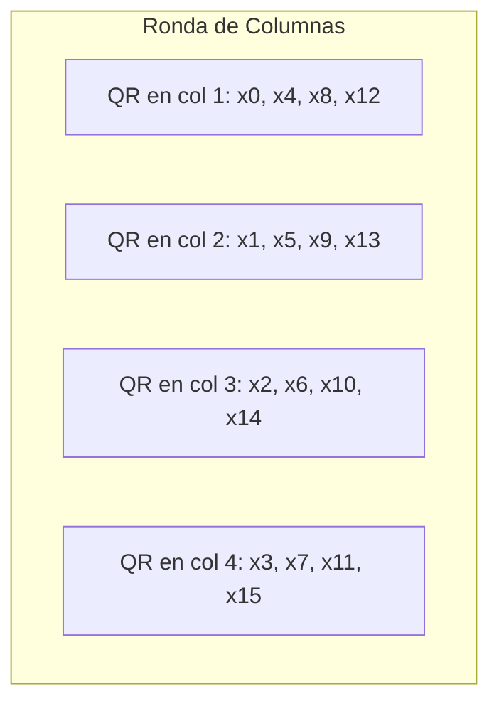
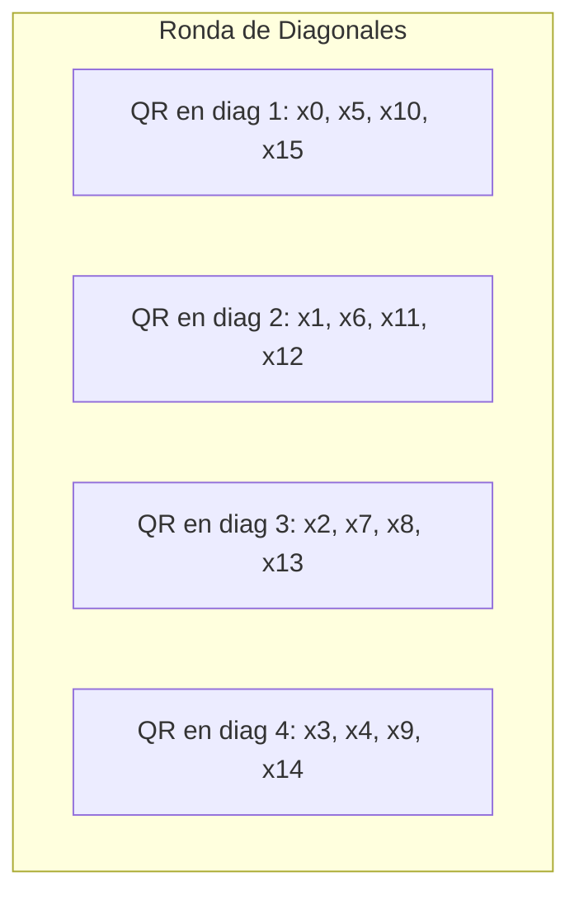
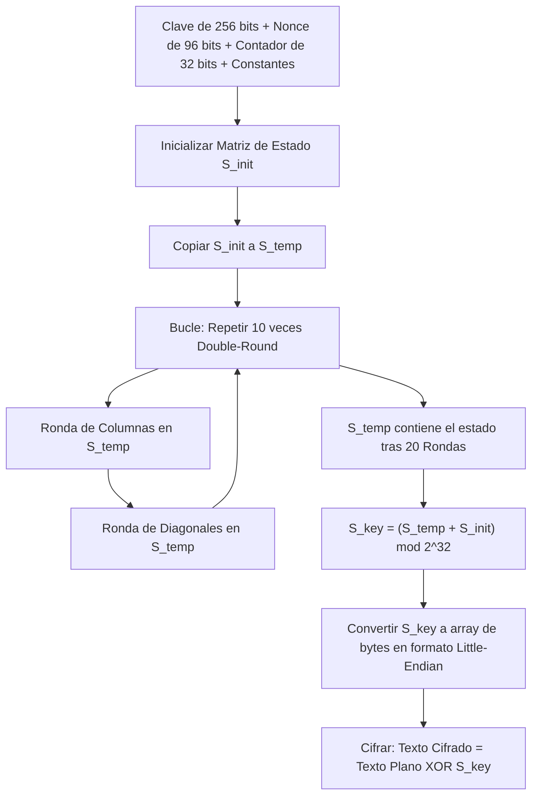

# Cifrado de Flujo ChaCha20: Fundamentos Matemáticos y Arquitectura

Este documento proporciona una explicación matemática detallada y rigurosa del cifrado de flujo **ChaCha20**, diseñado por Daniel J. Bernstein en 2008 como una variante de Salsa20. Este material está estructurado con el rigor teórico necesario para una asignatura de **Criptografía**.

---

## 1. Introducción Teórica

ChaCha20 es un **cifrado de flujo simétrico** de alto rendimiento. A diferencia de los cifrados de bloque (como AES en modo CBC o GCM) que dividen el mensaje en bloques fijos y los transforman, un cifrado de flujo genera una secuencia pseudoaleatoria de bits llamada **keystream** (flujo de clave). El cifrado se realiza mediante una operación XOR bit a bit entre el texto plano y el keystream:

$$C_i = P_i \oplus K_i$$

Donde:
*   $P_i$ es el texto plano.
*   $C_i$ es el texto cifrado.
*   $K_i$ es el flujo de clave (*keystream*).
*   $\oplus$ representa la operación XOR (OR Exclusivo).

La seguridad de ChaCha20 radica en que su función interna es una **función pseudoaleatoria (PRF)** extremadamente fuerte basada en un paradigma **ARX (Addition-Rotation-XOR)**. Al usar solo estas tres operaciones básicas, es inmune a ataques de canal lateral por tiempo de ejecución (ya que todas las operaciones tardan el mismo número de ciclos de reloj, independientemente de los datos).

---

## 2. La Matriz de Estado (The State)

Toda la computación de ChaCha20 opera sobre una matriz tridimensional implícita de **16 palabras de 32 bits** (un bloque de 512 bits o 64 bytes). La matriz se representa como una estructura de $4 \times 4$:

$$\text{Estado} = \begin{pmatrix} 
x_0 & x_1 & x_2 & x_3 \\ 
x_4 & x_5 & x_6 & x_7 \\ 
x_8 & x_9 & x_{10} & x_{11} \\ 
x_{12} & x_{13} & x_{14} & x_{15} 
\end{pmatrix}$$

### Inicialización del Estado (RFC 7539)

Antes de realizar cualquier ronda de cifrado, la matriz se inicializa con valores específicos:

1.  **Constantes Matemáticas ($x_0, x_1, x_2, x_3$):** 4 palabras (128 bits) que contienen la cadena ASCII `"expand 32-byte k"`.
    *   $x_0 = \text{0x61707865}$ (letras "apxe")
    *   $x_1 = \text{0x3320646e}$ (letras "3 dn")
    *   $x_2 = \text{0x79622d32}$ (letras "yb-2")
    *   $x_3 = \text{0x6b206574}$ (letras "k et")
    
    *Nota: Sirven como constantes "Nothing-up-my-sleeve" para asegurar que no hay backdoors en la inicialización.*

2.  **Clave de Cifrado ($x_4$ a $x_{11}$):** 8 palabras (256 bits) provistas por el usuario.
3.  **Contador de Bloques ($x_{12}$):** 1 palabra (32 bits) que inicia en `0` (o `1`) y se incrementa para cada bloque sucesivo de 64 bytes. Esto permite el acceso aleatorio al flujo (puedes descifrar el bloque $N$ directamente).
4.  **Vector de Inicialización o Nonce ($x_{13}, x_{14}, x_{15}$):** 3 palabras (96 bits) de un solo uso.

Visualmente, el estado inicial se estructura así:

```
+-----------------------------------+-----------------------------------+
|            Constante              |            Constante              |
|         x0 = 0x61707865           |         x1 = 0x3320646e           |
+-----------------------------------+-----------------------------------+
|            Constante              |            Constante              |
|         x2 = 0x79622d32           |         x3 = 0x6b206574           |
+-----------------------------------+-----------------------------------+
|             Clave [0]             |             Clave [1]             |
|                x4                 |                x5                 |
+-----------------------------------+-----------------------------------+
|             Clave [2]             |             Clave [3]             |
|                x6                 |                x7                 |
+-----------------------------------+-----------------------------------+
|             Clave [4]             |             Clave [5]             |
|                x8                 |                x9                 |
+-----------------------------------+-----------------------------------+
|             Clave [6]             |             Clave [7]             |
|                x10                |                x11                |
+-----------------------------------+-----------------------------------+
|             Contador              |             Nonce [0]             |
|                x12                |                x13                |
+-----------------------------------+-----------------------------------+
|             Nonce [1]             |             Nonce [2]             |
|                x14                |                x15                |
+-----------------------------------+-----------------------------------+
```

---

## 3. La Operación Fundamental: Quarter-Round (QR)

La base matemática de ChaCha20 es la función **Quarter-Round**. Esta función recibe cuatro palabras de 32 bits, denotadas como $(a, b, c, d)$, y las modifica in-place aplicando sumas modulares, XORs y rotaciones de bits.

### Ecuaciones Algebraicas del Quarter-Round

Dado el vector de entrada $(a, b, c, d)$, se aplican de forma secuencial las siguientes transformaciones de forma asimétrica para maximizar la difusión de bits:

1.  $$a \leftarrow (a \boxplus b) \pmod{2^{32}}; \quad d \leftarrow (d \oplus a) \lll 16$$
2.  $$c \leftarrow (c \boxplus d) \pmod{2^{32}}; \quad b \leftarrow (b \oplus c) \lll 12$$
3.  $$a \leftarrow (a \boxplus b) \pmod{2^{32}}; \quad d \leftarrow (d \oplus a) \lll 8$$
4.  $$c \leftarrow (c \boxplus d) \pmod{2^{32}}; \quad b \leftarrow (b \oplus c) \lll 7$$

Donde:
*   $\boxplus$ representa la suma aritmética ordinaria con desbordamiento (aritmética modular $\pmod{2^{32}}$).
*   $\oplus$ es la operación XOR binaria.
*   $\lll n$ es la **rotación circular hacia la izquierda** por $n$ posiciones binarias.

### Propiedades Matemáticas del QR
*   **Biyección (Reversibilidad):** Dado el output final del QR, y conociendo el orden exacto de los pasos, la función se puede invertir matemáticamente paso a paso (restas modulares en lugar de sumas, rotaciones a la derecha). Esto demuestra que no hay pérdida de información.
*   **Efecto Avalancha:** Debido a la mezcla asimétrica de operaciones no lineales (suma modular) y lineales (XOR y rotación), un cambio en un solo bit de entrada se propaga rápidamente a casi la mitad de los bits de salida en muy pocos pasos.

---

## 4. Las Rondas de Cifrado (Double-Round)

ChaCha20 ejecuta **20 rondas en total**. 
Una ronda consiste en aplicar la función $QR$ a cuatro subconjuntos de la matriz de estado. Las rondas se alternan en parejas llamadas **Double-Rounds** (Rondas Dobles): una ronda de columnas seguida de una ronda de diagonales.

### A. Ronda Impar: Ronda de Columnas (Column Round)
Se aplica la función $QR$ a las cuatro columnas verticales de la matriz de estado:

1.  $QR(x_0, x_4, x_8, x_{12})$ — Primera columna
2.  $QR(x_1, x_5, x_9, x_{13})$ — Segunda columna
3.  $QR(x_2, x_6, x_{10}, x_{14})$ — Tercera columna
4.  $QR(x_3, x_7, x_{11}, x_{15})$ — Cuarta columna



### B. Ronda Par: Ronda de Diagonales (Diagonal Round)
Se aplica la función $QR$ a las diagonales de la matriz (un mapeo que desplaza los índices para lograr una mezcla transversal completa de la información):

1.  $QR(x_0, x_5, x_{10}, x_{15})$ — Diagonal principal
2.  $QR(x_1, x_6, x_{11}, x_{12})$ — Primera diagonal desplazada
3.  $QR(x_2, x_7, x_8, x_{13})$ — Segunda diagonal desplazada
4.  $QR(x_3, x_4, x_9, x_{14})$ — Tercera diagonal desplazada



Un ciclo completo de **Double-Round** consta de 1 Ronda de Columnas + 1 Ronda de Diagonales (8 aplicaciones de $QR$ en total). ChaCha20 ejecuta **10 ciclos de Double-Rounds** (20 rondas en total).

---

## 5. El Paso Final: Feed-Forward (Suma de Estado Inicial)

Si simplemente tomáramos la matriz después de las 20 rondas como flujo de clave, el algoritmo sería **completamente inseguro**. ¿Por qué? Debido a que cada paso del Quarter-Round es reversible, un atacante que conozca 64 bytes de texto plano y cifrado podría hacer XOR para obtener el keystream, y luego revertir matemáticamente las 20 rondas de forma inversa para calcular la clave secreta original.

Para evitar esto, ChaCha20 utiliza una estructura similar a **Davies-Meyer** llamada **Feed-Forward**:

1.  Sea $S_{init}$ la matriz de estado inicial (antes de las rondas).
2.  Sea $S_{final\_20R}$ la matriz resultante tras aplicar las 20 rondas.
3.  La matriz de Keystream final ($S_{key}$) se calcula sumando ambas matrices elemento a elemento bajo aritmética modular $2^{32}$:

$$S_{key}[i] = (S_{final\_20R}[i] \boxplus S_{init}[i]) \pmod{2^{32}} \quad \forall i \in \{0, 1, \dots, 15\}$$

### ¿Por qué esto lo hace seguro?
Esta suma modular destruye la propiedad de biyección hacia atrás. Es matemáticamente impracticable recuperar $S_{init}$ a partir de $S_{key}$ porque la suma modular actúa como una función de un solo sentido (One-Way Function) cuando una de las partes es desconocida (la clave secreta oculta en $S_{init}$).

Una vez obtenida la matriz de Keystream $S_{key}$ (512 bits / 64 bytes), esta se serializa en orden Little-Endian y se realiza la operación XOR con los 64 bytes de datos correspondientes.

---

## 6. Resumen de Flujo Algorítmico

El algoritmo completo para cifrar un bloque de 64 bytes sigue estos pasos:



---

## 7. Preguntas de Examen / Discusión para Clase

Para prepararte para tu clase de criptografía, considera estas preguntas típicas sobre ChaCha20:

1.  **¿Por qué las constantes del estado inicial suman 128 bits?**
    Evitan ataques de punto fijo y garantizan que el atacante no pueda configurar matrices iniciales simétricas o de baja entropía.
2.  **¿Por qué se prefiere ChaCha20 sobre AES-GCM en dispositivos móviles?**
    AES fue diseñado para ser muy eficiente en hardware dedicado (instrucciones AES-NI en CPUs modernas). En dispositivos móviles antiguos o microcontroladores de baja potencia sin soporte de hardware, AES es lento y propenso a ataques de tiempo en caché. ChaCha20 se implementa de manera ultra rápida en software puro solo usando sumadores, rotadores y compuertas XOR en registros de CPU estándar.
3.  **¿Qué ocurre si se reutiliza el mismo Nonce con la misma Clave? (Nonce Reuse Attack)**
    Si se cifra el mensaje $A$ y el mensaje $B$ con el mismo nonce y clave, el keystream generado será idéntico ($K$). Un espía obtendría $C_A = A \oplus K$ y $C_B = B \oplus K$. Al hacer XOR entre ambos textos cifrados:
    $$C_A \oplus C_B = (A \oplus K) \oplus (B \oplus K) = A \oplus B$$
    Esto elimina la encriptación y expone directamente la relación XOR entre ambos mensajes originales, facilitando enormemente la ruptura de ambos textos con análisis de frecuencia o formatos conocidos.
