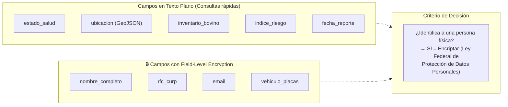
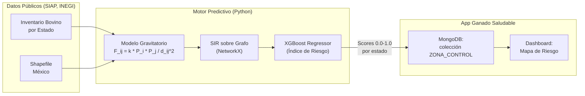

# Propuesta de Arquitectura: App Ganado Saludable (v2)

Este documento define la arquitectura teórica de la aplicación de trazabilidad y vigilancia epidemiológica, detallando:

1. El **esquema de base de datos** NoSQL (MongoDB).
2. El **flujo de encriptación** de datos sensibles.
3. La integración con el **motor de predicción** (Modelo Gravitatorio + XGBoost).

> **Decisión Estratégica (Mockup vs. Desarrollo Completo):**
> Para la presentación, el esfuerzo se enfoca en *demostrar el diseño conceptual y la viabilidad técnica* (diagramas, esquemas y resultados del modelo matemático) en lugar de programar el backend completo. Esto maximiza el impacto visual con mínima fricción técnica.

---

## 1. Esquema de Base de Datos (MongoDB)

Al ser una base de datos orientada a documentos (NoSQL), no tenemos "tablas" rígidas, sino **colecciones** de documentos JSON. A continuación se presenta el modelo Entidad-Relación de las colecciones principales:


### Ejemplo de Documento JSON (MongoDB)

```json
{
  "_id": "ObjectId('665a1b2c3d4e5f6a7b8c9d0e')",
  "granja_id": "ObjectId('665a1b2c3d4e5f6a7b8c9d0f')",
  "animal_id": "ObjectId('665a1b2c3d4e5f6a7b8c9d10')",
  "fecha_reporte": "2026-05-15T10:30:00Z",
  "sintomas": "Lesiones vesiculares en lengua y pezuñas, fiebre 40.5°C",
  "diagnostico_presuntivo": "Sospecha de FMD (Serotipo O)",
  "metodo_diagnostico": "ELISA NSP",
  "probabilidad_riesgo": 0.87,
  "estatus": "Pendiente confirmación RT-PCR"
}
```

---

## 2. Esquema de Encriptación y Seguridad (Criptografía)

Dado que manejamos datos sensibles (ubicación de granjas y la identidad de los ganaderos), el sistema implementa una arquitectura de seguridad basada en los algoritmos vistos en clase: **Funciones Hash** y **Cifrado Asimétrico (RSA)**.

### Especificaciones Técnicas de Criptografía

| Capa | Algoritmo / Técnica | Propósito en la Aplicación |
|------|---------------------|---------------------------|
| **Passwords de Usuarios** | `bcrypt` (Función Hash con sal) | Las contraseñas de los ganaderos nunca se almacenan en texto plano. Se usa `bcrypt` para aplicar un Hash matemático irreversible, protegiéndolos contra hackeos de la base de datos. |
| **Datos Personales (PII)** | `RSA` (Cifrado Asimétrico) | Para proteger el nombre y correo del ganadero en la base de datos, usamos la Llave Pública (RSA) para encriptar la información al guardarla. Solo la autoridad (CPA) tiene la Llave Privada para desencriptarla cuando se requiere. |
| **Tokens de Sesión** | `JWT` firmado con RSA | Cuando el usuario inicia sesión en la App, se le entrega un token firmado criptográficamente para validar su identidad sin tener que mandar la contraseña en cada petición. |

### ¿Qué campos están encriptados?



> **Principio rector:** Se encripta todo lo que la *Ley Federal de Protección de Datos Personales en Posesión de Particulares (LFPDPPP)* clasifica como dato personal identificable. Los datos epidemiológicos (estado_salud, ubicación, inventario) se mantienen en texto plano para permitir consultas geoespaciales y analíticas en tiempo real sin penalización de rendimiento.

---

## 3. Integración con el Motor de Predicción

La app no opera de forma aislada. Se alimenta del pipeline de Machine Learning:



El modelo XGBoost calcula un **Índice de Riesgo Sistémico (0.0 a 1.0)** para cada estado, basado en 13 variables de Teoría de Grafos:
- **Masa Biológica:** Inventario bovino actual.
- **Topología de Red:** Centralidad de Intermediación (Betweenness), PageRank, Cercanía.
- **Vectores de Infección:** Flujo Gravitatorio Saliente (weighted_out_flux) y Entrante (weighted_in_flux).
- **Fricción Geográfica:** Distancia asfáltica promedio al resto del país.

Este score predictivo se inyecta automáticamente en el campo `indice_riesgo` de las colecciones `GRANJA` y `ZONA_CONTROL`, permitiendo a los veterinarios de la CPA priorizar inspecciones estructurales (ej. blindar las granjas en estados con alto *flujo gravitatorio saliente*, independientemente de dónde haya iniciado un brote).

---

## 4. Próximos Pasos (To-Do para el Equipo)

| # | Tarea | Responsable | Entregable |
|---|-------|-------------|------------|
| 1 | Revisar diagramas de BD y aprobar colecciones | Compañero | Feedback en PR |
| 2 | Descargar Shapefile INEGI + CSV SIAP | Equipo | ✅ Completado |
| 3 | Programar Modelo Espacial (`02_gravity_model.py`, `03_spatial_sir.py`) | Yo | ✅ Completado |
| 4 | Generar animaciones S-I-R (Race Chart + Stacked) | Yo | ✅ Completado |
| 5 | Entrenar XGBoost y derivar Node Embeddings | Yo | ✅ Completado (R²=0.843) |
| 6 | Diseñar slides de arquitectura y seguridad | Compañero | Diapositivas con los diagramas de este doc |
