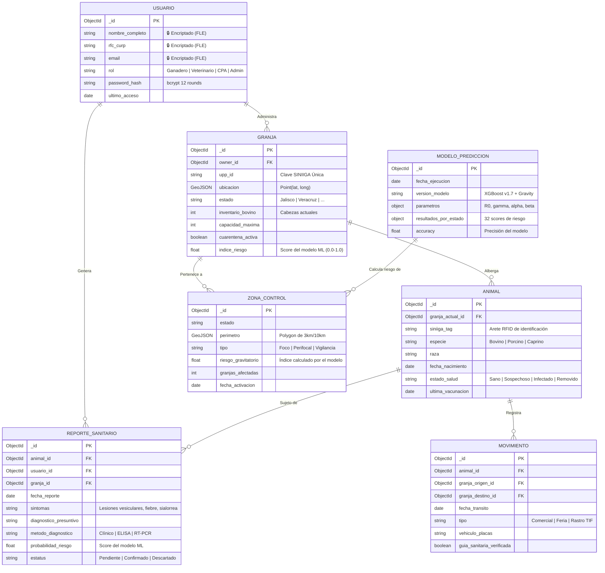
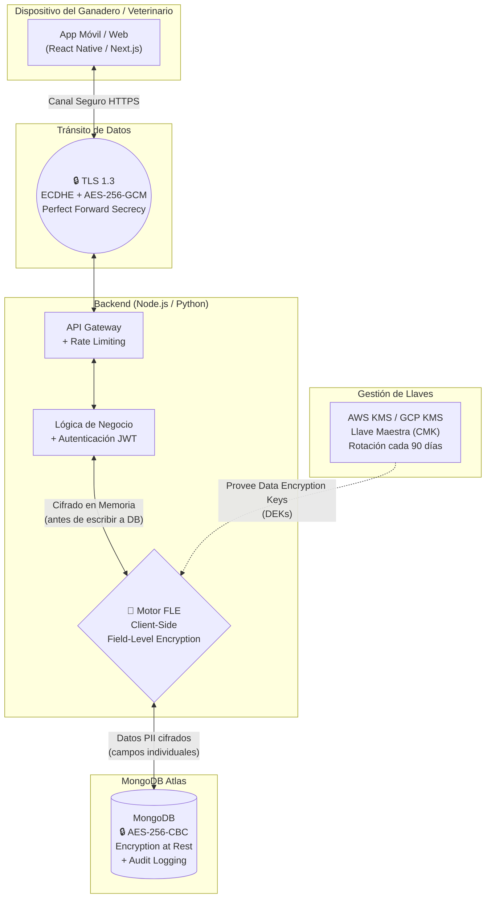
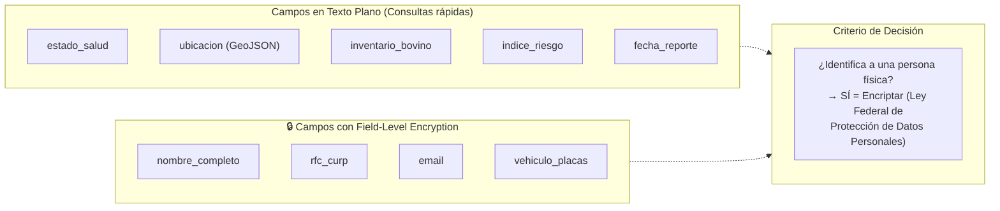
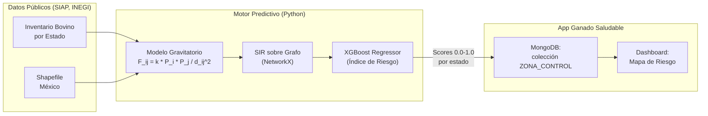

# Propuesta de Arquitectura: App Ganado Saludable (v2)

Este documento define la arquitectura teórica de la aplicación de trazabilidad y vigilancia epidemiológica, detallando:

1. El **esquema de base de datos** NoSQL (MongoDB).
2. El **flujo de encriptación** de datos sensibles.
3. La integración con el **motor de predicción** (Modelo Gravitatorio + XGBoost).

> **Decisión Estratégica (Mockup vs. Desarrollo Completo):**
> Para la presentación, el esfuerzo se enfoca en *demostrar el diseño conceptual y la viabilidad técnica* (diagramas, esquemas y resultados del modelo matemático) en lugar de programar el backend completo. Esto maximiza el impacto visual con mínima fricción técnica.

---

## 1. Esquema de Base de Datos (MongoDB)

Al ser una base de datos orientada a documentos (NoSQL), no tenemos "tablas" rígidas, sino **colecciones** de documentos JSON. A continuación se presenta el modelo Entidad-Relación de las colecciones principales:



### Ejemplo de Documento JSON (MongoDB)

```json
{
  "_id": "ObjectId('665a1b2c3d4e5f6a7b8c9d0e')",
  "granja_id": "ObjectId('665a1b2c3d4e5f6a7b8c9d0f')",
  "animal_id": "ObjectId('665a1b2c3d4e5f6a7b8c9d10')",
  "fecha_reporte": "2026-05-15T10:30:00Z",
  "sintomas": "Lesiones vesiculares en lengua y pezuñas, fiebre 40.5°C",
  "diagnostico_presuntivo": "Sospecha de FMD (Serotipo O)",
  "metodo_diagnostico": "ELISA NSP",
  "probabilidad_riesgo": 0.87,
  "estatus": "Pendiente confirmación RT-PCR"
}
```

---

## 2. Esquema de Encriptación y Seguridad (Criptografía)

Dado que manejamos datos sensibles (ubicación de granjas, identidad de ganaderos y estatus sanitario que puede afectar mercados internacionales de $3,000M USD anuales), implementamos un modelo de **seguridad de tres capas**.



### Especificaciones Técnicas de Criptografía

| Capa | Estándar | Algoritmo | Detalle Técnico |
|------|----------|-----------|-----------------|
| **En Tránsito** | TLS 1.3 | `ECDHE_RSA_WITH_AES_256_GCM_SHA384` | Perfect Forward Secrecy: si roban la llave hoy, no desencriptan datos de ayer. Cada sesión genera una llave efímera Diffie-Hellman sobre curva elíptica. |
| **En Reposo** | AES-256 | `AES-256-CBC` (MongoDB WiredTiger) | Todo el volumen de disco está cifrado de forma transparente. Si roban el disco físico, los datos son ilegibles sin la llave maestra. |
| **A Nivel de Campo (FLE)** | AEAD | `AES-256-CBC + HMAC-SHA-512` | Los campos PII (`nombre_completo`, `rfc_curp`, `email`) se cifran **antes de salir del servidor** hacia la base de datos. Ni el DBA puede leerlos sin la Data Encryption Key (DEK) gestionada por el KMS externo. |
| **Passwords** | bcrypt | `bcrypt` con 12 rounds de sal | Las contraseñas nunca se almacenan en texto plano. bcrypt es resistente a ataques de GPU por diseño (memory-hard). |
| **Tokens de Sesión** | JWT | `RS256` (RSA 2048-bit) | Los tokens de autenticación se firman asimétricamente. El servidor solo necesita la llave pública para verificar, reduciendo la superficie de ataque. |

### ¿Qué campos están encriptados?



> **Principio rector:** Se encripta todo lo que la *Ley Federal de Protección de Datos Personales en Posesión de Particulares (LFPDPPP)* clasifica como dato personal identificable. Los datos epidemiológicos (estado_salud, ubicación, inventario) se mantienen en texto plano para permitir consultas geoespaciales y analíticas en tiempo real sin penalización de rendimiento.

---

## 3. Integración con el Motor de Predicción

La app no opera de forma aislada. Se alimenta del pipeline de Machine Learning:



El modelo XGBoost calcula un **Índice de Riesgo Sistémico (0.0 a 1.0)** para cada estado, basado en:
- Inventario bovino (masa gravitatoria)
- Centralidad en la red de movimiento de ganado
- Distancia a los estados más conectados
- Número de rastros TIF
- Valor de exportaciones

Este score se inyecta automáticamente en el campo `indice_riesgo` de las colecciones `GRANJA` y `ZONA_CONTROL`, permitiendo a los veterinarios de la CPA priorizar las inspecciones.

---

## 4. Próximos Pasos (To-Do para el Equipo)

| # | Tarea | Responsable | Entregable |
|---|-------|-------------|------------|
| 1 | Revisar diagramas de BD y aprobar colecciones | Compañero | Feedback en PR |
| 2 | Descargar Shapefile INEGI + CSV SIAP | Equipo | Archivos en `data/raw/` |
| 3 | Programar `gravity_network.py` | Yo | Script + gráfica de la red |
| 4 | Generar animación de propagación (GIF/MP4) | Yo | Archivo para la presentación |
| 5 | Entrenar XGBoost y generar mapa de riesgo | Yo | Mapa coroplético + métricas |
| 6 | Diseñar slides de arquitectura y seguridad | Compañero | Diapositivas con los diagramas de este doc |
